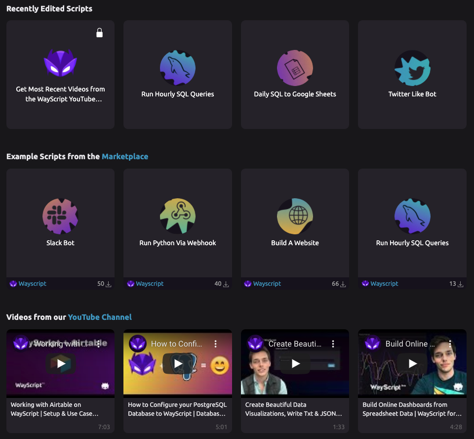
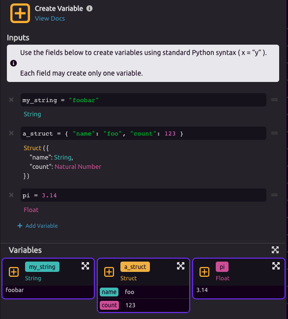
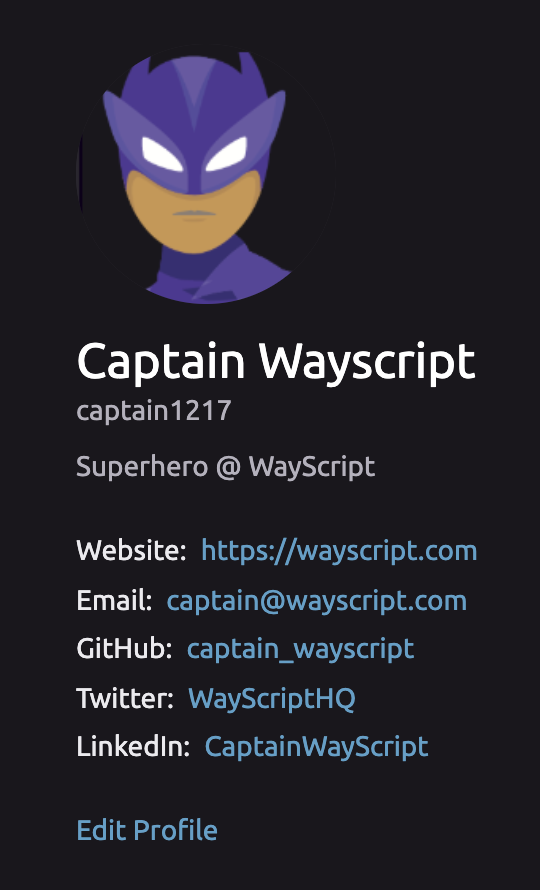
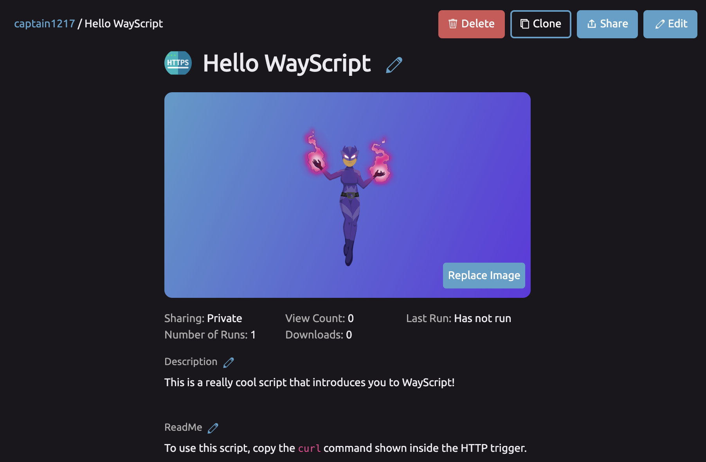
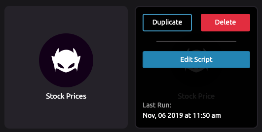
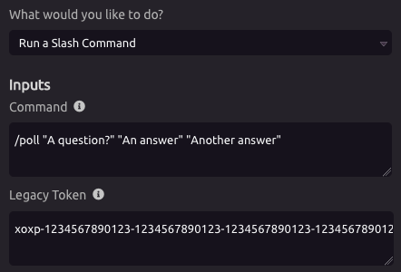
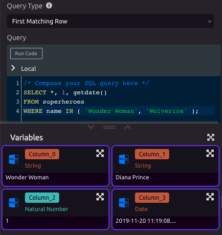
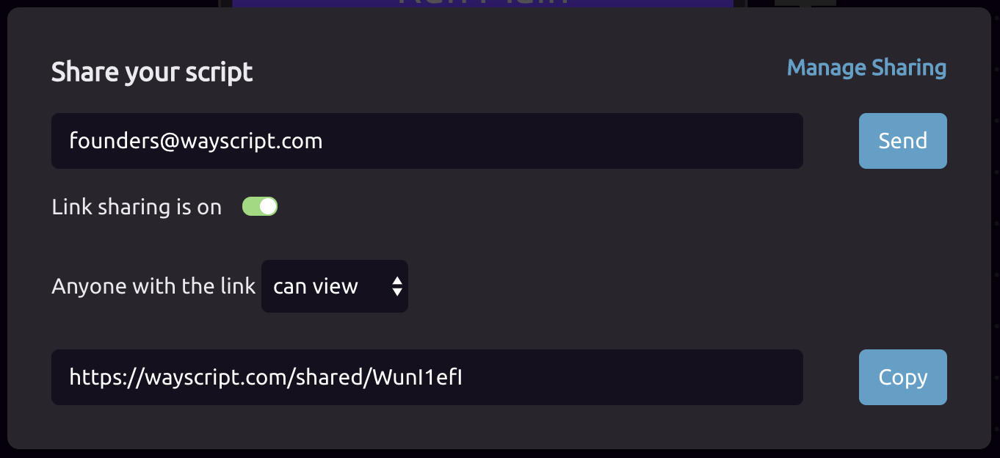

# What's New?

## August 19th, 2020

*  Use the new [Datadog](library/modules/datadog.md) module to retrieve monitor data! 
*  You can now suspend your script for a given amount of time using the [Sleep](library/logic/sleep.md) module. 
*  We have added a new "[Get Self Data](library/modules/calendly.md#get-self-data)" mode to the [Calendly](library/modules/calendly.md) module.

## August 11th, 2020

* 🎉 WayScript raises $5M seed round! [Read the note](https://wayscript.com/learn/wayscript-raises-$5m-seed-round) from WayScript's founders, [Jesse](https://wayscript.com/user/jesse) and [Lane](https://wayscript.com/user/lane), about the process and the future of WayScript. 
*   We have added a [Calendly](library/modules/calendly.md) module!

## August 5th, 2020

*  You can now use the [Gmail](library/modules/gmail.md) module to [send emails](library/modules/gmail.md#send-email) from your Gmail account. 
*  We have added the option to [Log in with Google](https://support.google.com/accounts/answer/112802), which will work with your existing WayScript email address, so long as it's associated with an existing Google account. 
* JSON outputs are now structs. **This is possibly a breaking change, if you have referenced these outputs in a code module.**

## July 29th, 2020

* You can now choose to run your [Function Calls](library/logic/functions/function-call.md) asynchronously, using the [Run Async](library/logic/functions/function-call.md#running-a-function-asynchronously) setting. One common use-case for this setting is to immediately return a `200 Success` response from the [HTTP Response](library/modules/http-response.md) module, while performing a long-running task on a background thread. 
* The [Form Trigger](library/triggers/form-trigger.md) now allows users to [upload and submit PDF files](library/triggers/form-trigger.md#5-file-upload), which you can then use later in your script.

## July 22nd, 2020

* New code modules are available!

  *  We have added support for [Java](library/modules/java/) to our [Programming Language](getting_started/code-editors.md) offerings!
  *  We have also added a [Shell Script](library/modules/shell-script.md) module, allowing you to run Bash shell scripts as part of your WayScript workflow.

* [Time Zone](library/triggers/time-trigger.md#select-a-time-zone) is now configurable in the [Time Trigger](library/triggers/time-trigger.md) settings, making it easier to schedule your scripts to run whenever you like.



## July 15th, 2020

* [Form descriptions](library/triggers/form-trigger.md#title-and-description) now support markdown! 
* The [ZenHub](library/modules/zenhub.md) module has a new "[Release Report](library/modules/zenhub.md#get-release-reports)" mode.

## July 7th, 2020

* We have added a [File Download](library/modules/http-response.md#success-200) response to the [HTTP Response](library/modules/http-response.md) module, so you can return files from your custom endpoints, which will be downloaded to the calling user's machine. 
* There is a new [ZenHub](library/modules/zenhub.md) module, for integrating with the GitHub issue management software.

## June 25th, 2020

* We have added a new [Debug Mode](getting_started/debugging.md) that allows you to step through your script! 
* Trello "[Create a New Card](library/modules/trello.md#create-a-new-card)" mode has a new [Card ID](library/modules/trello.md#outputs-2) output, so you can work with the new card later in your script.


## June 17th, 2020

* We have added a [Jira](library/modules/jira.md) module for automating work tasks and issues.

## June 10th, 2020

* You can now [output events](library/modules/stripe.md#view-events) from the [Stripe](library/modules/stripe.md) module.

## May 7th, 2020

* [GraphQL](library/modules/graphql.md) for API queries is now available as a coding language.

## April 29th, 2020

* You can now use the [SendGrid](library/modules/sendgrid.md) module to send marketing emails! 
* We have added an [Assert](library/logic/assert.md) module, which allows you to ensure that a condition is met before your script continues executing. If the assertion fails, you also have the option to send yourself an email.

## 🌎 April 22nd, 2020

* The [Trello module](library/modules/trello.md) now allows you to [add an attachment](library/modules/trello.md#update-a-card) when creating a Trello card, [search](library/modules/trello.md#search-for-a-card) your Trello cards, and [update](library/modules/trello.md#update-a-card) a Trello card. 
* The [JSON module](library/modules/json.md) has a new [Parse String](library/modules/json.md#parse-string) mode, which allows you to convert a JSON string into a [WayScript struct variable](getting_started/variables.md#struct).

## April 15th, 2020

* Try our [New User Walkthrough](https://wayscript.com/ftu)! 
* The [Github module](library/modules/github.md) now supports public and private organization repositories. 
* The [Form](library/triggers/form-trigger.md#raw-request-data) and [HTTP](library/triggers/http-trigger.md#raw-request-data) Triggers can now optionally output the raw data submitted to the trigger's endpoint.

## April 8th, 2020

* We have added a new [Figma](library/modules/figma.md) module to allow you to work with your Figma files, projects, comments, users, and more, with WayScript. 
* We have improved the script editing experience to separate variable loading from settings panel loading, allowing you to continue to change settings for a module while the script's variables are still loading.

## April 1st, 2020

* We have moved the navigation bar to the top of the page, and added an Activity Feed, where you will receive notifications for activity relevant to you, such as when another user clones your script or new content is available. 
* We have updated the script editing experience with a refreshed look and feel and the ability to only import the libraries you need into your script, reducing clutter and streamlining the script building experience. 
* We have added [crontab syntax](library/triggers/time-trigger.md#crontab-syntax) to the [Time Trigger](library/triggers/time-trigger.md), allowing you to specify exactly how frequently you would like your script to run.

## March 25th, 2020

* We have added a new [user home page](https://wayscript.com/home), to make it easy to find recently edited scripts, explore the marketplace, and watch videos from the [WayScript YouTube channel](https://www.youtube.com/channel/UCv1JpM-XII0PMnqoCJfZA2g), all in one place. Click on the WayScript logo in the navigation bar to check it out!



## March 13th, 2020

* We have updated the variable selectors and inputs in the script editor to make working with variables easier than ever! 
* The [YouTube module](library/modules/youtube.md) now lets you search for videos on a specific channel, using the [Channel ID](library/modules/youtube.md#inputs) advanced setting. 
* The endpoints for [Form](library/triggers/form-trigger.md) and [HTTP](library/triggers/http-trigger.md) triggers have **moved to** [**wayscript.io**](http://wayscript.io/).
  * To access your Form and HTTP endpoints, you should now use the script ID as a subdomain of **wayscript.io**.  \(e.g. [1234.wayscript.io](https://1234.wayscript.io)\)
  * Existing wayscript_.com_ endpoints will redirect to wayscript_.io_ for the time being, so your current scripts will continue to work.


 Please update your code to consume the latest WayScript [Python](https://pypi.org/project/wayscript/) and [JS](https://www.npmjs.com/package/wayscript) packages and change any POST requests to call **wayscript.io**.

Legacy wayscript._com_ Form and HTTP endpoints will be disabled in the future and you will eventually be required to use the new wayscript._io_ endpoints.


## March 6th, 2020

* We have added a new [Chart Module](library/modules/chart.md),  which allows you to create [line](library/modules/chart.md#line-chart) and [pie](library/modules/chart.md#pie-chart) charts.
  * 📊Bar charts coming soon!
  * [Chart variables](getting_started/variables.md#chart) can be placed in a [Dashboard Response](library/modules/dashboard-response.md), [Print to Log](library/logic/print-to-log.md) statement, and other places you would expect to see output.


* We have updated the [Form Trigger](library/triggers/form-trigger.md) to have [customizable endpoints](library/triggers/form-trigger.md#endpoints) and [password protection](library/triggers/form-trigger.md#password-protect-your-form), similar to the [HTTP Trigger](library/triggers/http-trigger.md). 
* The [Google Sheets](library/modules/google-sheets.md) module has a new [Preserve Header Row](library/modules/google-sheets.md#preserve-header-row) setting for use when you are writing to a spreadsheet with both the "[Replace File](library/modules/google-sheets.md#write-mode)" and "[Include Headers](library/modules/google-sheets.md#include-headers)" options enabled and would like to replace everything EXCEPT the header row on each run of your script.



## February 27th, 2020

* You can now import and reference code from other Python and JavaScript files in your scripts. \(See the [Python](library/modules/python/#importing-code-from-other-files) and [JavaScript](library/modules/javascript.md#importing-code-from-other-files) module docs for more information on how to do this.\)


* We have two new modules for reading and writing [.JSON](library/modules/json.md) and [.TXT ](library/modules/txt-file.md)files. 
* We have revamped the [Account Settings page](https://wayscript.com/settings). For details on managing your account, check out the [Account Management](https://docs.wayscript.com/account-management) section of the docs.

## February 19th, 2020

* We have added a [Form Trigger](library/triggers/form-trigger.md), which allows you to build a web form for your script. When the form is submitted, the script is triggered with the form data. You can add [text inputs](library/triggers/form-trigger.md#1-text-input) and [text areas](library/triggers/form-trigger.md#2-text-area), [selectors](library/triggers/form-trigger.md#3-selector), and [radio buttons](library/triggers/form-trigger.md#4-radio-buttons). You can even customize the look and feel of your form with [your own CSS](library/triggers/form-trigger.md#advanced).


* We have added a new [Dashboard Response](library/modules/dashboard-response.md) module, which will render script variables to a beautiful dashboard interface. You can use this response in conjunction with the [Form Trigger](library/triggers/form-trigger.md), as well as the [HTTP Trigger](library/triggers/http-trigger.md).


* In the [Python](library/modules/python/#working-with-variables) and [JavaScript](library/modules/javascript.md#working-with-variables) modules, we have made working with variables easier by adding a "variables" dictionary. This dictionary can be used to reference variables from your script in your Python and JavaScript code, as well as output new variables into your script. \(The "variables" dictionary replaces the old "inputs" and "outputs" dictionaries, although these legacy dictionaries are still available, so your existing scripts won't break.\)

```python
# Read in variables created previously in your script
x = variables[ 'An_Existing_Variable' ]

# Create new variables for use later in your script
variables[ 'First_Output' ] = 'Testing'
```



## February 12th, 2020

* You can now easily Undo & Redo changes while editing scripts!
  * Use the Undo/Redo buttons in the editor 
  * On Mac, Undo with `⌘ Command`+`Z` and Redo with `⇧ Shift`+`⌘ Command`+`Z`
  * On Windows, Undo with `Ctrl`+`Z` and Redo with `Ctrl`+`Y`



## February 5th, 2020

* We have added an [RSS Feed module](library/modules/rss-feed.md) for pulling data from your favorite RSS feed. 
* The WayScript blog page is now [WayScript Learn](https://wayscript.com/learn)! We have refreshed the look of the page, added tags, and search functionality. Happy learning! 
* We have added a [Stripe module](library/modules/stripe.md) for getting account info from Stripe. Check out the video below to see it in action!



## January 23rd, 2020

* We have a new and improved fullscreen code editing experience, where you can take advantage of your screen real-estate to more easily add and edit files, run your code, and see output. Refer to [Code Editors](getting_started/code-editors.md) for more details.


* We have launched a new [Community Marketplace](https://wayscript.com/marketplace), where you can see, sort, and clone copies of other users' public programs! \(All publicly shared programs appear in the community marketplace by default.\)




## January 15th, 2020

* We have updated the [Create Variable](library/logic/create-variable.md) module so that you can now declare variables using "Pythonic" syntax and create multiple variables of different types in the same step. You can also [edit variable values](library/logic/create-variable.md#updating-the-value-of-a-variable) using the Create Variable module. For a tutorial on creating variables in WayScript, see the ["Variables" section of Getting Started](getting_started/variables.md).



* You can now [Update a Row](library/modules/airtable.md#update-a-row) using the Airtable module. 
* Stop your [Python](library/modules/python/) and [JavaScript](library/modules/javascript.md) code by pressing the "Stop Running" button during code execution.   
* We have received requests for users who want to contribute modules to the platform. [Here is a link](https://github.com/wayscript/wayscript_modules/blob/master/giphy.py) to an example of our Giphy module that you can use as a template. You can submit your modules back to us and we will publish them. This is our first step toward eventually open-sourcing our modules.   We are happy to work with anyone who tries to build a module! Please [reach out on our Discord channel](https://discord.gg/hRkE7PP) with any questions. 
* The [WayScript Marketplace](https://wayscript.com/marketplace) has been refreshed with a new look and feel!

## December 17th, 2019

* We have added the ability to edit your user profile!
  * You can now update your profile image, add a bio, and set your contact information.
  * You can also [share the URL of your profile](https://wayscript.com/user/captain1217) to allow people to see your page and view your publicly available scripts.



* We have added a customizable landing page for your scripts! From this page, you can:
  * Edit the name and description of your script.
  * Add a ReadMe using Markdown.
  * Customize the script logo and banner image.
  * Delete, clone, share, or edit your script.
  * View statistics about your script.



* We have added a [Variable Storage](library/logic/variable-storage.md) module, which  allows you to store the values of variables in your WayScript programs.
* The outputs of most modules have been updated to utilize the new, easy-to-use "struct" variable type.
  * Structs allows you to drill down into variables using the `.` operator. For example, you can access the content of a particular [Tweet](library/modules/twitter.md) within a list of Tweets by referencing `Tweets.0.content`.
  * Refer to the documentation for each individual module to see the contents and structure of the output data.

## November 20th, 2019

* We have added a [RegEx module](library/modules/regex.md) that makes it easy to find pattern matches in text.
* The Dashboard has been updated to show a more streamlined view of your scripts.



* You can now run [Slack "Slash Commands"](https://api.slack.com/interactivity/slash-commands) using the [Slack module](library/modules/slack.md). These commands require use of the [Legacy Slack API](https://api.slack.com/custom-integrations/legacy-tokens), so [follow the docs](library/modules/slack.md#run-a-slash-command) for details on setting this up.



* SQL and Spreadsheet column outputs now infer the type of the variable in the column.



## November 13th, 2019

* **You can now** [**easily share scripts**](getting_started/sharing.md) **with public links and manage permissions!**
  * [Share with the world](getting_started/sharing.md#sharing-your-script) via a publicly accessible link
  * [Limit access](getting_started/sharing.md#managing-sharing-and-access) by only sharing with a specific person
  * Allow users to run scripts in your account without needing to copy the script to their account
  * Manage permissions by adding, deleting, or changing users' access



* **We have revamped the experience in the** [**HTTP Trigger**](library/triggers/http-trigger.md)**!**
  * [Sample code](library/triggers/http-trigger.md#sample-code) makes it easier than ever to quickly run a program from your terminal
  * You can pass [query parameters](library/triggers/http-trigger.md#request-query-parameters) and/or [JSON body parameters](library/triggers/http-trigger.md#request-json-body-parameters) when triggering your program
  * The WayScript [Python](https://pypi.org/project/wayscript/) and [JavaScript](https://www.npmjs.com/package/wayscript) libraries have been updated to take advantage of the new functionality in the HTTP Trigger
  * The Webhook Trigger has been deprecated, as all of its functionality \(and more!\) is available in the HTTP Trigger

## November 4th, 2019

* We have updated the login and signup flows to provide more information and streamline the process.
* We have made it easier to add comments within your scripts.
* Added more consistent styling for variable colors, so it's easer to determine the types of your variables.
* When adding variables, you are now given a preview of the variable's content.
* You can now drill down into variables using the `.` operator. For example, you can access the content of a particular [Tweet](library/modules/twitter.md) within a list of Tweets by referencing `Tweets.0.content`.


## October 16th, 2019

* Reply-to addresses are now available as an [output of the Gmail trigger]().

## October 8th, 2019

* You can now log in with GitHub!

## September 13th, 2019

* [Google Assistant](library/triggers/google-assistant-trigger.md) integration is now available! Trigger your WayScript programs by saying "Hey, Google" and have the Google Assistant [respond back to you](library/modules/google-assistant.md).
* You can now [password-protect your custom HTTP endpoints](library/triggers/http-trigger.md#password-protect-your-endpoints).
* Added [Discord](library/triggers/discord-trigger.md) functionality, so you can trigger WayScript programs to run when various Discord events occur, or interact with Discord channels [using the WayScript bot](library/modules/discord.md).
* New [Twitter](library/modules/twitter.md) functionality:
  * [Pull a list of followers/following for a Twitter username](library/modules/twitter.md#get-user-followers-and-following)
  * [Like Twitter posts](library/modules/twitter.md#like-a-tweet)

## September 6th, 2019

* Now you can preview [templates](https://wayscript.com/library) in "read-only" mode. [Click here for an example!](https://wayscript.com/view_template/Build%20A%20Website)
* WayScript no longer requires a beta key, so anyone can create an account!
* Documentation for each module now appears in a panel on the right side of the script editor, so you don't have to interrupt your flow to look something up!

## August 30th, 2019

* Added functionality for [hosting your own web app in WayScript](https://www.youtube.com/watch?reload=9&v=OrZMjdVhFfA&feature=youtu.be). This includes the following features:
  * [HTTP Trigger](library/triggers/http-trigger.md), which allows you to trigger a function when a user visits a URL.
  * [HTTP Response](library/modules/http-response.md) module, which returns the output of your script as an HTTP response.
  * [HTML module](library/modules/html.md) for composing HTML code to serve as content on your webpage.
  * [CSS module ](library/modules/css.md)for styling your webpage.
  * [Images module](library/modules/images.md) for adding images to your scripts and including them in HTML.
  * Option to [output raw JS code](library/modules/javascript.md#output-raw-javascript-code) from the [JavaScript module](library/modules/javascript.md), to include it in HTML.
  * The [Build a Website](https://wayscript.com/library/Build_A_Website) template is now available in the [Template Library](https://wayscript.com/library).
* The [Python module](library/modules/python/) now includes the [Chrome headless browser](https://developers.google.com/web/updates/2017/04/headless-chrome), which you can interact with [using Selenium](library/modules/python/libraries.md#using-selenium). 
* You can now [add comments to steps within your scripts](getting_started/modules.md#add-comments-to-a-step).

## August 23rd, 2019

* [Python Slackbot](https://wayscript.com/library/Slack_Bot) added to the [Template Library](https://wayscript.com/library).
* Variable pills now work in code editors.
* You can now share scripts that contain modules requiring authentication.
* Added ability to [trust a computer](account-management/two-factor-authentication.md#trust-a-computer) when using Two-Factor Authentication.

## August 20th, 2019

* Added the [JavaScript module](library/modules/javascript.md), where you can compose and run your own custom JavaScript code as part of your scripts. This module also allows you to [define custom npm dependencies](library/modules/javascript.md#adding-dependencies).
* Added [Else-If](library/logic/conditionals.md#if-else-if-else) functionality to the [Conditional](getting_started/conditionals.md#add-branches) logic module.
* Added a [While Loop](library/logic/loop/while-loop.md) module.

## August 15th, 2019

* Added a [Template Library](https://wayscript.com/library), where you can get started with ready-made scripts. This replaces the Sidekick functionality.
* You can now [define custom requirements](library/modules/python/#adding-additional-requirements) in the Python module and edit your code in an expanded full-screen mode.

