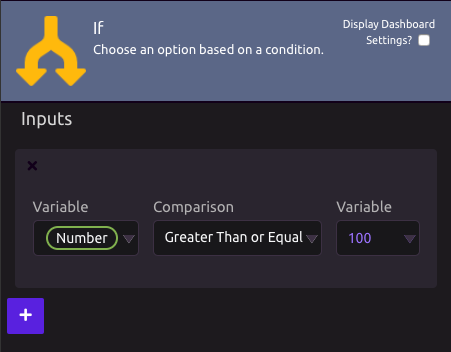
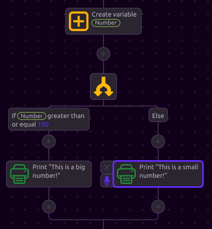
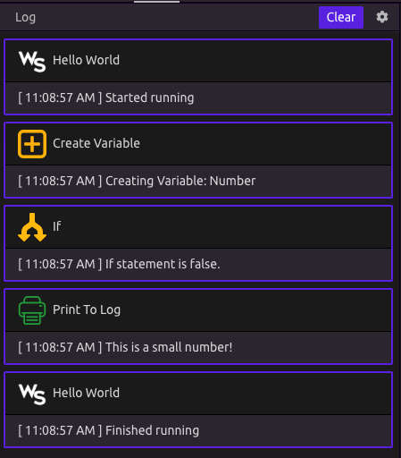

# Conditionals


Please read the [Hello World](hello-world.md) and [Variables](variables.md) sections before continuing with this section.



For a full list of conditions for each variable type, read the [Conditionals Logic Documentation](../library/logic/conditionals.md).


## What is a condition?

In programming, a conditional \(also known as "[if-statement](../library/logic/conditionals.md#if-else)"\) is a control-flow statement directing your program to perform different actions depending on whether or not the programmer-specified _condition_ is `true` or `false`.

## 🌟 Creating Conditions in WayScript

###  Create a Variable

For this example, we create a variable called Number and set it to the value 4. 

###  Create a Condition

Drag the "If" module from your Logic Panel as the next step in your program.

### ⚙ Define Your Conditions

For this example, we want to build logic that says "**If** our Number variable is greater than or equal to 100 - then print "This is a big number", **Else** print "This is a small number".

### 🌵Add Branches

We can also add additional branches to our conditional. The first branch which is **True** will execute. If no branch is **True** then the **Else** branch will execute.

### 🌲 Add Branch Actions

We can now add different sets of actions to each **branch** of the conditional. If the condition is **True,** it will execute one set of actions, otherwise it will run a different set of actions. We can have as many branches as we want and the first branch that is **True** will execute \(see note above\).

### ▶ Run your Program

Press the "Run Main" button to run your program. You can see that the If-statement evaluated to False \(because 4 is not greater than or equal to 100\). Our program prints "This is a small number!".

Try changing the number of your Number variable and rerunning the program. 


For a full list of conditions for each variable type, read the [Conditionals Logic Documentation](../library/logic/conditionals.md).


