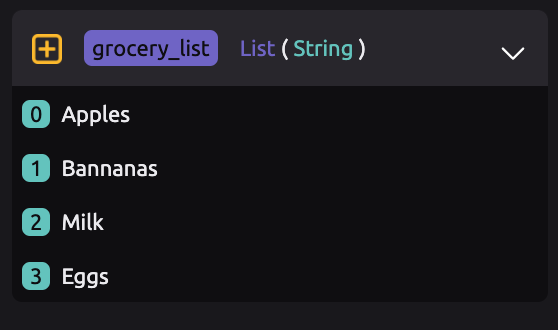
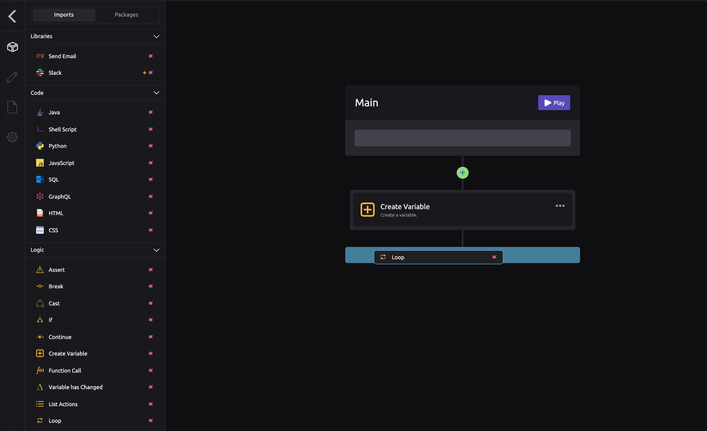
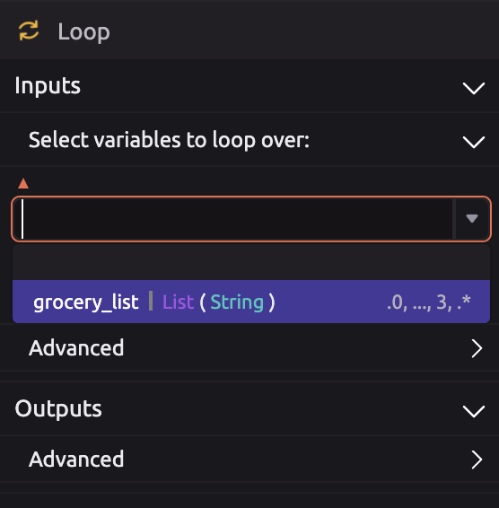
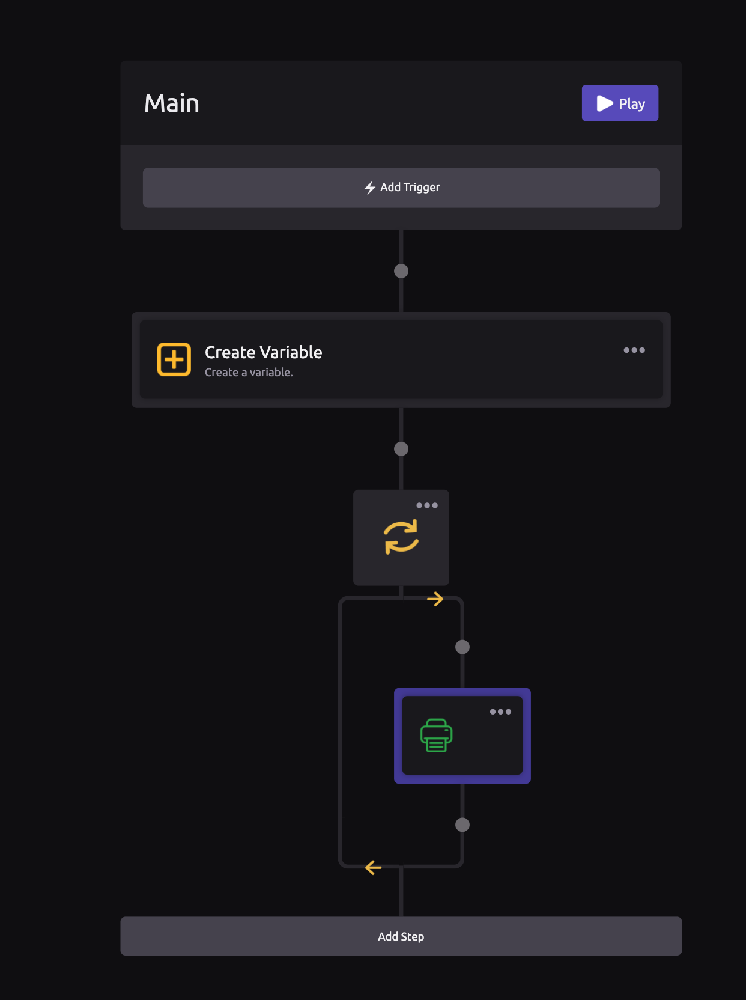
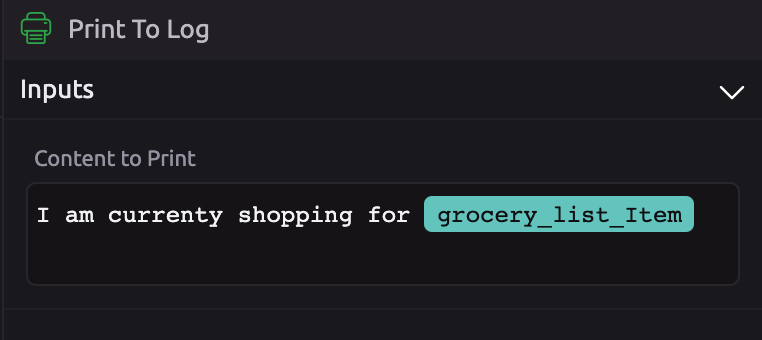
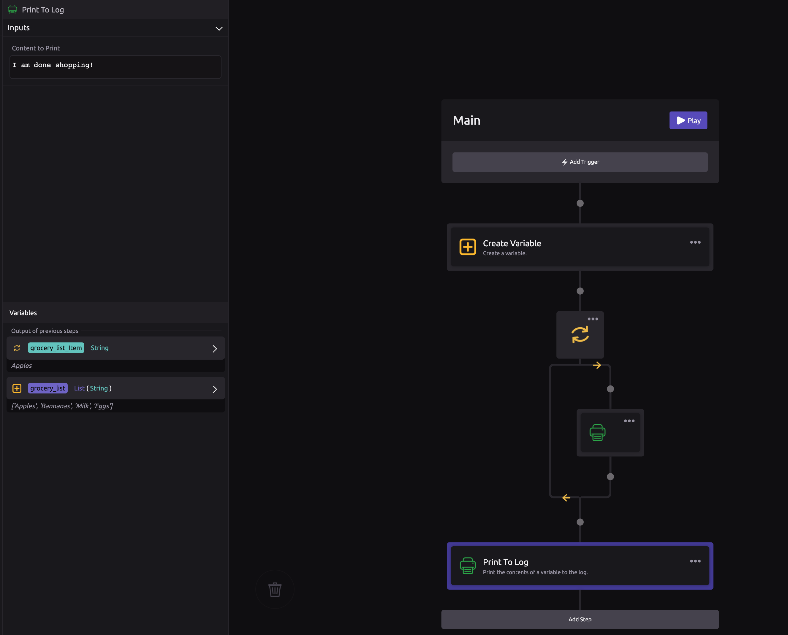
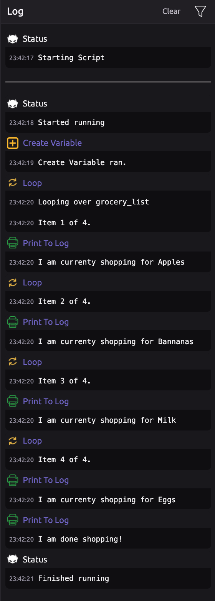

# Looping / Iteration


If you have not read about [WayScript Lists](variables.md#lists), please do so before continuing.


## What is a loop?

In programming, a **for-loop** is a control-flow statement directing your program to execute the loop's contents repeatedly. 🔁 

##  Looping with WayScript

The power of looping is easiest to demonstrate with an example.

##  Create a List

In this example, we build the same grocery list variable from the [WayScript Lists documentation](variables.md#lists). 

###  Create a Loop

Drag in the Loop Module from the **Logic Panel** as the next step in your program flow. 

In the **Loop Settings Panel**, select your Grocery List variable as an input to loop over. 

Notice how you now have a variable in your Variable Panel called **Grocery List Item.** In programming, this is known as an 'iterator' and can be used as a variable at any step inside of the loop. 

At each loop iteration, the value of **Grocery List Item** will change to the next item in the list. This loop will iterate four times, once for each item in the list. To make this more clear, let's print the value of **Grocery List Item** for each loop. To do this, we must drag the Print To Log module inside of the loop.

In the Print To Log setup, let's print a sentence and include our **Grocery List Item** variable.

Finally, let's add a print statement **after** the loop that says "I'm done shopping!"

### ▶ Run Your Program

Press the "Run Main" button to run your program. Now, look at the results in the log. Notice how the loop ran four times, each time with the new value for your Grocery List Item variable. At the end, your "I'm done shopping!" line printed. 

