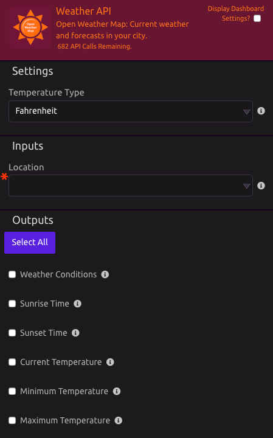
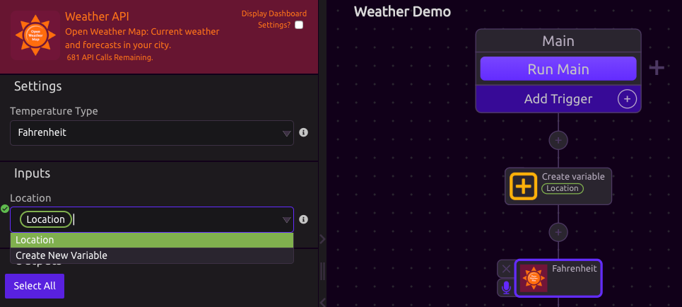

# Modules


Please read the [Hello World](hello-world.md) and [Variables](variables.md) sections before continuing with this section.



Check out the [Modules](../library/modules/) section of the Docs for detailed information on each WayScript module.


## What is a Module?

WayScript modules give you the ability to automate tasks and actions with third party applications. The easiest way to think of a Module is like a station on an assembly line. First, you **setup** your station to your specifications, then you **input** the necessary components, work is done, and finally you get a shiny new **output**. WayScript leverages third party APIs to let you treat these applications and tools as steps in your assembly line.

As an introduction, we are going to build a program that pulls the current temperature for a location and sends you an email with the data.  

## Select your Module

In order to get the temperature, we are going to use the [Weather API Module](../library/modules/weather-api.md). ****Select this module from your Modules Panel and drag it into your flow diagram. 

## Setup your Module

Notice the three sections of this module - Settings, Inputs, and Outputs. When setting up a module, you should start from the top and work your way down to the bottom. 

### Settings

Under Settings, we want to setup the options for our Module. In this case, the Weather API Module wants to know if we want our results returned in Fahrenheit, Celcius, or Kelvin. Select whichever result you would like.

### Inputs

In the Inputs Section, the module requires a [Location](../library/modules/weather-api.md#inputs) -- in other words, it is asking what location you want weather information on. The red star next to the input is telling you that this input is **required**, otherwise, the module cannot run. This setup identical to being on a weather website and typing in your location to get the forecast. 

There are two methods for correctly setting up your input.

#### Method One: Insert a Variable

First option, we can [create a text variable](variables.md) _before_ the Weather Step in our program flow. Once again think about an assembly line - the variable needs to be created before it can used by a future step in the program. If we do that, the variable will become accessible to us in the input dropdown. 

#### Option Two: Hardcode a Value

A second option is to just type in the location you are looking for. Hardcoding is a useful feature if you don't need the Location to be a variable. This would be the case if you do not need to reference the variable anywhere else in your program. 

#### A Note on Hardcoding

Yes, you can mix variables with hardcoding! If I [created a variable](variables.md) called "State" and set it to "NY", I could then create the following input:

### Outputs

When you select Outputs from your Module, they become variables that can be used in your program. These variables are the same as those created in the [Variables Tutorial ](variables.md)in that they can be [single items](variables.md#single-item) or [lists](variables.md#lists), and can be [different data types](variables.md#variable-types) such as text, numbers, dates, etc. Notice below how the checked outputs are now available in the Variables Panel.

