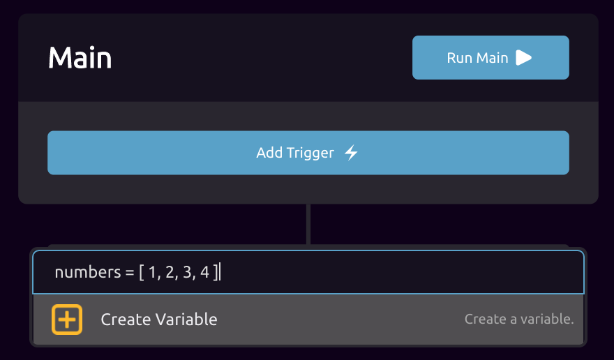

# Power Users

## ⌨ Editor Hot Keys



| To do this | Press | When |
| :--- | :--- | :--- |
| Create empty variable 'pill'  | + i | Editing text |
| Undo last action | + z | No Inputs Selected |
| Undo last action | + y | No Inputs Selected |
| Move around program 'tree' to highlight steps/targets | Arrow Keys | No Inputs Focused, 'tree' in view |
| Select step | 'Enter' or 's'  | When step is highlighted |
| Remove step | 'Delete' | When step is highlighted |
| Run Trigger/Function | 'r' | when trigger/function is highlighted |
| Open 'Create Step Dropdown'  | 'Enter' or 's' | when target is highlighted |



| To do this | Press | When |
| :--- | :--- | :--- |
| Create empty variable 'pill'  | 'Ctrl + i' | Editing text |
| Undo last action | 'Ctrl + z' | No Inputs Focused |
| Undo last action | 'Ctrl + y' | No Inputs Focused |
| Move around program 'tree' to highlight steps/targets | Arrow Keys | No Inputs Focused, 'tree' in view |
| Select step | 'Enter' or 's'  | When step is highlighted |
| Remove step | 'Delete' | when step is highlighted |
| Run Trigger/Function | 'r' | when trigger/function is highlighted |
| Open 'Create Step Dropdown'  | 'Enter' or 's' | when target is highlighted |



## 🃏 Variable Wildcards

The asterisk \(wildcard\) character can be using within variable pills to reformat data. For example, imagine you have a list of tweets called `Tweets`, but instead want a list of the username associated with each  tweet. You could create a pill `Tweets.*.username`, which would build a list by pulling the `username` key from each tweet item. The wildcard here would be replaced with each possible value within the Tweets list to build the resulting list, ie `Tweets.0.username`, `Tweets.1.username`, etc.

## 💪 Editor Power Features

### ➕ Create Variable Shortcut

1. Open 'Add Step' dialog.
2. Type variable definition\* in search input.
3. Press 'Enter' to create variable.

\*Not all variable types are supported in this shortcut. Supported types are:

* String
* Number
* List\( String \)
* List\( Number \)

