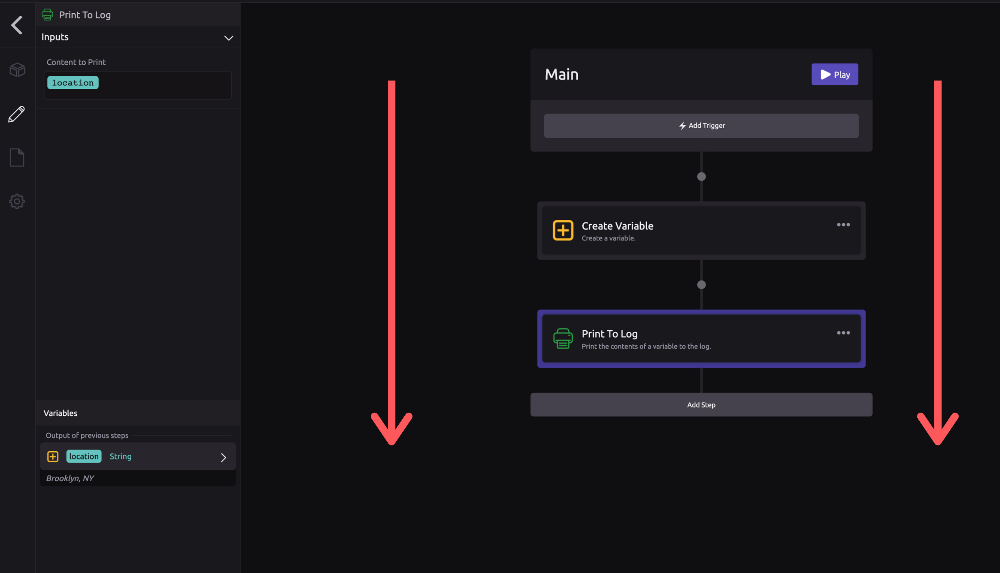
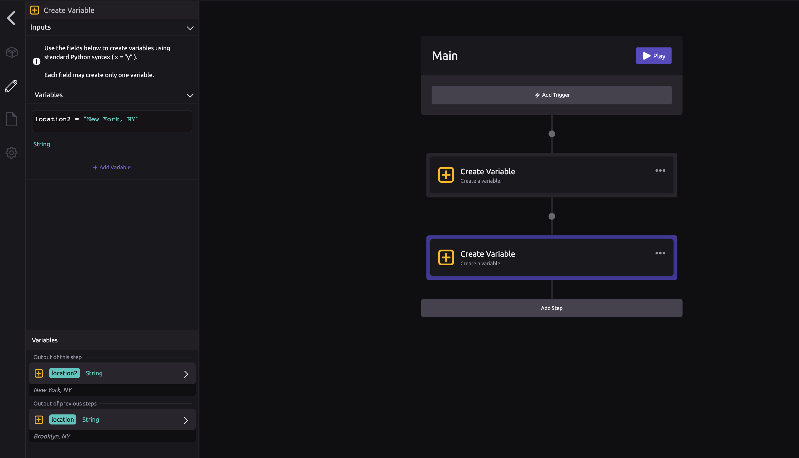
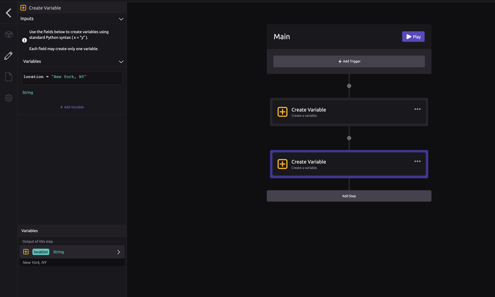

# Program Flow

## 🏃♀ Program Run Order

When you build a WayScript program, your program executes in order. The easiest way to think of this is like each step in your program is a stop on an assembly line. Each station on the assembly line can use anything built at a previous station, but not a later one. Something needs to have been built before it can be used. 

If I want to print a variable, that variable needs to have been created _before_ the print step. 

If you were to switch the order of these two steps, then the 'Location' variable would not be accessible in the Print to Log step because it has not been created yet. 

## 🔤 Variable Values

Like in other programming languages - **the names of variables matter**. Therefore, if you create a second variable with the same name, the value of the variable is overwritten. 

### 💡 Different Variable Names

In the image below, a new variable, 'Location2' has been created. Therefore, the 'Location' variable with value "Brooklyn, NY" still exists. 

### ✏ Overwrite Variable

Below, at step 2, the value of 'Location' is "New York, NY". The starting value, "Brooklyn, NY" was overwritten since the same variable name was used.

