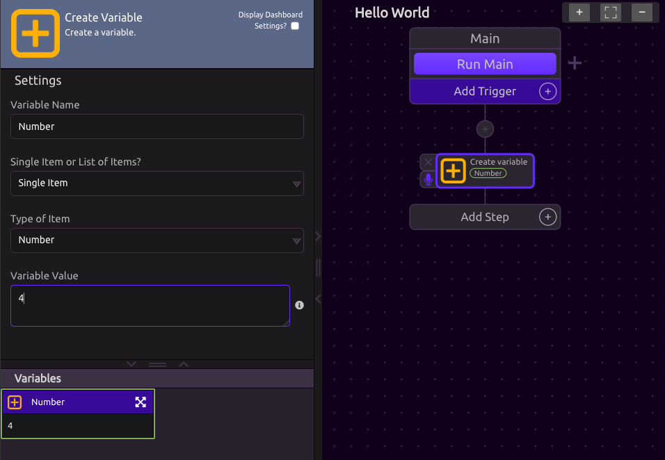
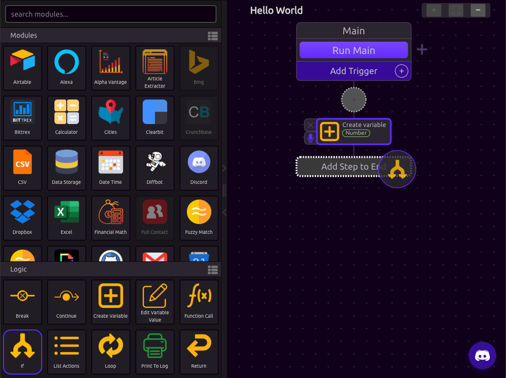

# Conditionals


Please read the [Hello World](hello-world.md) and [Variables](variables.md) sections before continuing with this section.



For a full list of conditions for each variable type, read the [Conditionals Logic Documentation](../library/logic/conditionals.md).


## What is a condition?

In computer science, conditional statements are features of a programming language, which perform different computations or actions depending on whether a programmer-specified _condition_ is true or false.

## Creating conditions in WayScript

### Create a Variable

For this example, we create a variable called Number and set it to the value 4. 

### Create a Condition

Drag the "If" module from your Logic Panel as the next step in your program.

### Define your Conditions

For this example, we want to build logic that says "**IF** our Number variable is greater than or equal to 100 - then print "This is a big number", **ELSE** print "This is a small number".

### Run your Program

