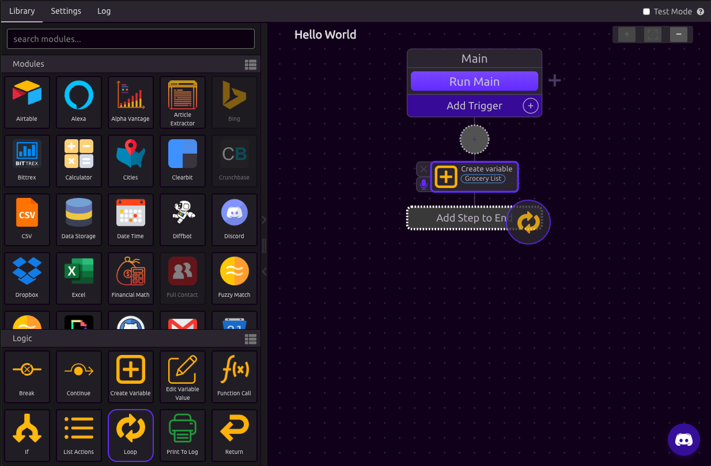
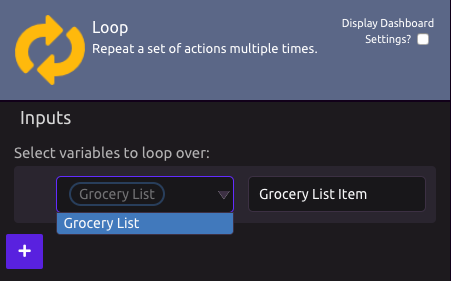
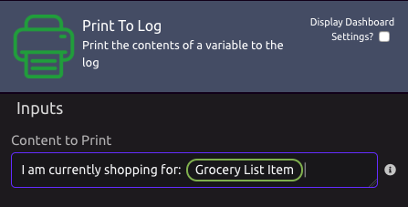
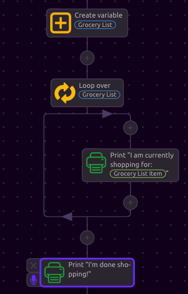

# Looping / Iteration

**Note, if you have not read about** [**WayScript Lists**](variables.md#lists)**, do so before continuing.**

## What is a loop?

In computer science, a **for-loop** is a control flow statement for specifying iteration, which allows code to be executed repeatedly.

## Looping with WayScript

The power of looping is easiest to demonstrate with an example.

### Create a List

In this example, we build the same grocery list variable from the [WayScript Lists documentation](variables.md#lists). 

### Create a Loop

Drag in the Loop Module from the **Logic Panel** as the next step in your program flow. 

In the **Loop Settings Panel**, select your Grocery List variable as an input to loop over. 

Notice how you now have a variable in your Variable Panel called **Grocery List Item.** In programming, this is known as an 'iterator' and can be used as a variable at any step inside of the loop. For each loop, the value of **Grocery List Item** will change to the next item from the list. This list will loop 4 times because there are four items in the list. To make this more clear, lets print the value of **Grocery List Item** for each loop. To do this, we must drag the Print To Log module inside of the loop.

In the Print To Log setup, lets print a sentence and include our **Grocery List Item** variable.

Finally, lets add a print statement **after** the loop that says "I'm done shopping!"

### Run your Program

Press the 'Run Main' button to run your program. Now, look at the results in the log. Notice how the loop ran 4 times, each with the new value for your Grocery List Item variable. At the end, your I'm done shopping line printed. 

