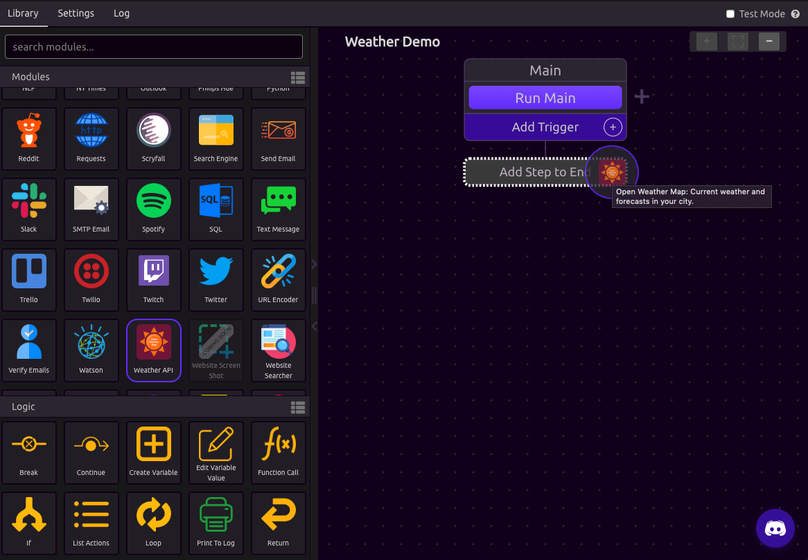

# Modules


Please read the [Hello World](hello-world.md) and [Variables](variables.md) sections before continuing with this section.



Check out the [Modules Section of the Docs](../library/modules/) for detailed information on every Module.


## What is a Module?

WayScript modules give you the ability to automate tasks and actions with third party applications. The easiest way to think of a Module is like an assembly line. First, you **setup** your machines to your specifications, then you **input** the necessary components, work is done, and finally you get a shiny new **output**. WayScript leverages third party APIs to let you treat these applications and tools as steps in your assembly line.

## Example

In this example, we are going to build a program that pulls the current temperature for a location and sends you an email with the data.  

### Select your Module

In order to get the temperature, we are going to use the **Weather API Module.** Select this module from your Modules Panel and drag it into your flow diagram. 

### Setup your Module

#### Settings

#### Inputs

#### Outputs

