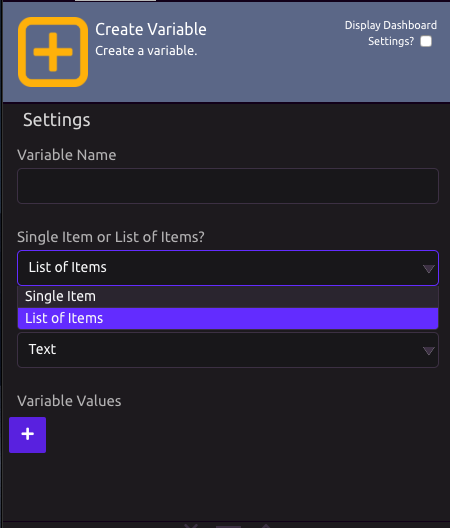
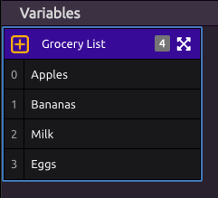

# Variables

## What is a Variable?

"**Variables** are used to store information to be referenced and manipulated in a computer program. They also provide a way of labeling data with a descriptive name, so our programs can be understood more clearly by the reader and ourselves. It is helpful to think of variables as containers that hold information. This data can then be used throughout your program." - LaunchSchool

## Create Variable Setup

Drag the **Create Variable** module into your program flow diagram.

Once dropped, WayScript will automatically display the Settings Panel for your Create Variable step. This is where you are going to set up your variable. 

## Single Item

For this example, we are going to create a **Variable Name** called "Location" and set it to the **Variable Value** "Brooklyn, NY". Feel free to put in your own location instead.

Once the data is inputted, you should notice that your variable now appears in your **Variables Panel.** You can now use this variable in your program. 

Notice that the Location Variable has a green border. This is a visual indication that the variable is a single item \(in this case, Brooklyn NY\).

#### Example of using a Single Item Variable

Now - you can use this variable at any future step in your WayScript program flow. In this example, we can now print a message which contains the Location variable. 

You can begin typing the variable name to get access, or you can drag the variable from the Variable Panel into the box.

## Lists

### What is a list?

A list \(also called an array\) is a tool that can be used to store multiple pieces of information at once. It can also be defined as a variable containing multiple other variables.

### Creating a List

In your Create Variable Settings, change your mode to a **List of Items.**

A grocery list is a great example of a list we can build. The use cases for lists will be discussed more in the **Looping** section of the docs. In this example, we create a list with a **Variable Name** of "Grocery List" and add our grocery list items as **Variable Values.**

Your Grocery List has now become a variable that can be used in your WayScript program. Note that the variable is outlined in blue and tell you the number of items in your list. 

## Power-User Features

