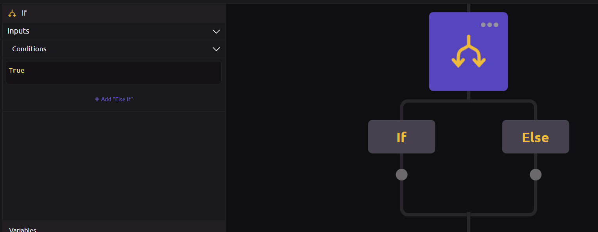
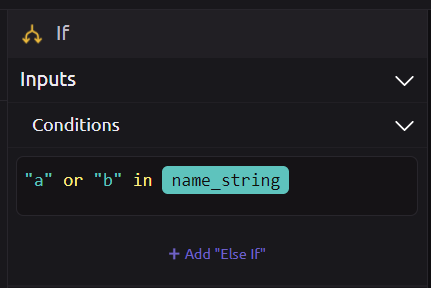

# Conditionals



For an overview on conditionals in WayScript, refer to the [Introduction to Conditionals](../../getting_started/conditionals.md).


##  Condition Block

You will use this block to define a logic expression.

To create a logic expression, you will typically compare two variables or values. This is done by using python syntax:




Default is True, leaving True will result in the statement always evaluating to True so the if side of the conditional above will execute. False is also a valid input which results in the else side executing. 


### 🔢 Number Comparison Options

The conditionals logic follows python syntax. Here are some options:

```text
Number == 4     #Check if Number is Equal to 4
Number != 4     #Check if Number is Not Equal to 4
Number > 4      #Check if Number is greater than 4
Number < 4      #Check if Number is less than 4
Number >= 4     #Check if Number is greater than or equal to 4
Number <= 4     #Check if Number is less than or equal to 4
```

### 🔤 Text Comparison Options

Conditionals follow python syntax and options. There are several options for strings and lists:

```text
==      #Check if strings equal
!=      #Check if strings not equal
in      #Check if string is in another string
```

### 📆 Date Comparison Options

Date comparisons in python follow the same syntax as number comparisons.

```text
==      #Check if dates equal
!=      #Check if dates not equal
>       #Check if date is after 
<       #Check if date is before
>=      #Check if date is after or equal
<=      #Check if date is before or equal
```

### 🔠 Case Sensitive 

Following python syntax, comparisons are case sensitive and will evaluate false if two strings have different capitalization. Python string methods such as .lower\(\) and .upper\(\) can be useful if you want to avoid case sensitivity.

### 📈 "Changed By" Comparisons

Please see the "Has changed" Module for comparisons used in conjunction with "has changed" or "changed by" logic.

## \*\*\*\*➕ **Adding Multiple Conditions**

By pressing the **+ Add Condition** button, you can add additional conditions.

### 💡 Logical Operators

* **And:** Use if you want your expression to evaluate to `True` only when _**both**_ conditions are `True`.
* **Or:** Use if you want your expression to evaluate to `True` when _**at least one**_ of your conditions are `True`.



##  **If / Else-If / Else**

The **If** branch will run if your logic expression evaluates to `True`.

The **Else-If** branch will run if the proceeding logic expression evaluates to `False`, but the logic expression in the current Else-If branch evaluates to `True`.

The **Else** branch will run if all of the proceeding logic expressions evaluate to `False`.


In the above image, our variable Number is equal to 4. Since we first evaluate the left most branch \( the if statement \) we see that our Number is not greater than 10. Therefore this evaluates as false and then we move right to the Else If branch. This branch checks to see if Number is equal to 5. Since Number is 4, this evaluates as false and our else branch is True. 


