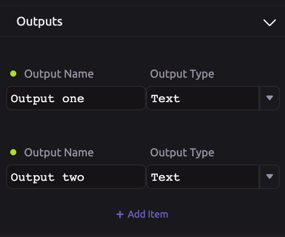
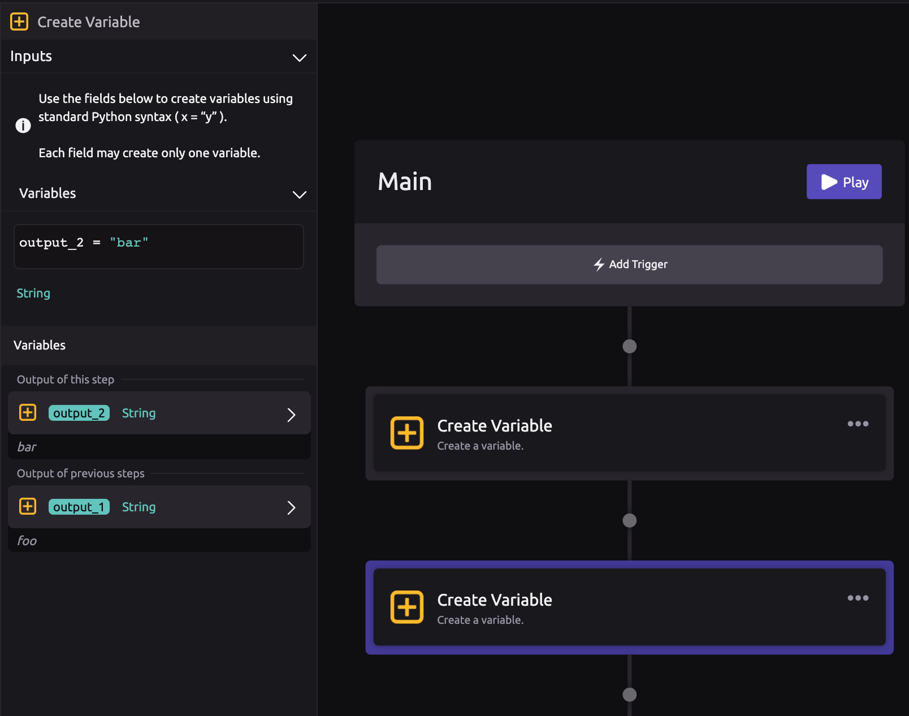
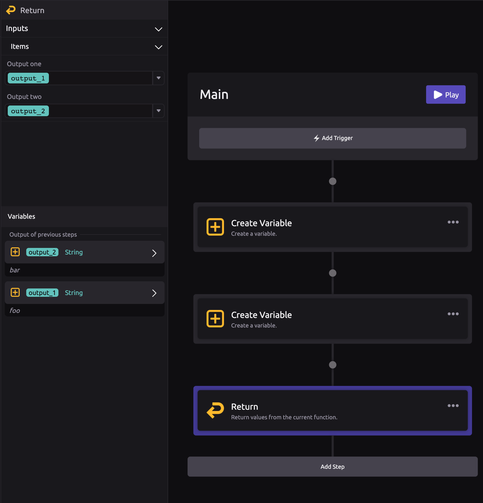

# Return

##  **Return from the Current Function**

Use the Return module inside a function to finish running the current function and return values to the location that called the function.

The Return module will populate the settings panel with a field for each output that was set up for the current function.

## ✨ Example

[Define a function](function-definition.md) with two outputs, called "Output one" and "Output two."

Now, create two variables, called "foo" and "bar."

Use the Return module to return the values of "foo" and "bar" from the function, using "Output one" and "Output two."

