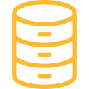

# Variable Storage

The variable storage module allows you to store the values of variables in your WayScript program. This allows for persistance in between program runs without having to set up a database.   
  
There are two modes: read values and write values

### Read Values

You can read in as many variables as you want. When you press the '+' sign to add a new variable to read in, you are asked for the variable name and the default value. 

* **Variable Name** - this is the name of the variable you are importing. If you have written a variable to Variable Storage, this should be the name of the variable you have stored. 
* **Default Value** - this field allows you to set a default value for your variable using _\***python syntax\*.**_ If you have already stored a value to the Variable Name, the variable created will have the stored value. Otherwise, it will use the default value that you assign. 

### Write Values

Select variables from your program that you would like to store. The variable name you store is the same name you will type into Read Values \(see above\) in order to pull out the variable data. 

### FAQ

* Does Write Values overwrite the stored data. If you have stored a variable and then remove this variable from future writes, the variable will persist in the database. In order to clear your storage, press the Clear Data Storage button. 


Clear Data Storage is an irreversible action! - Be Careful


