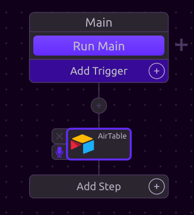
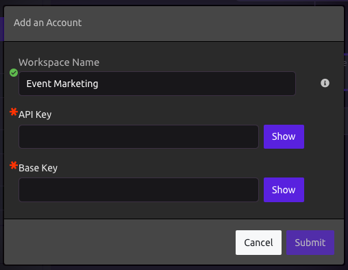
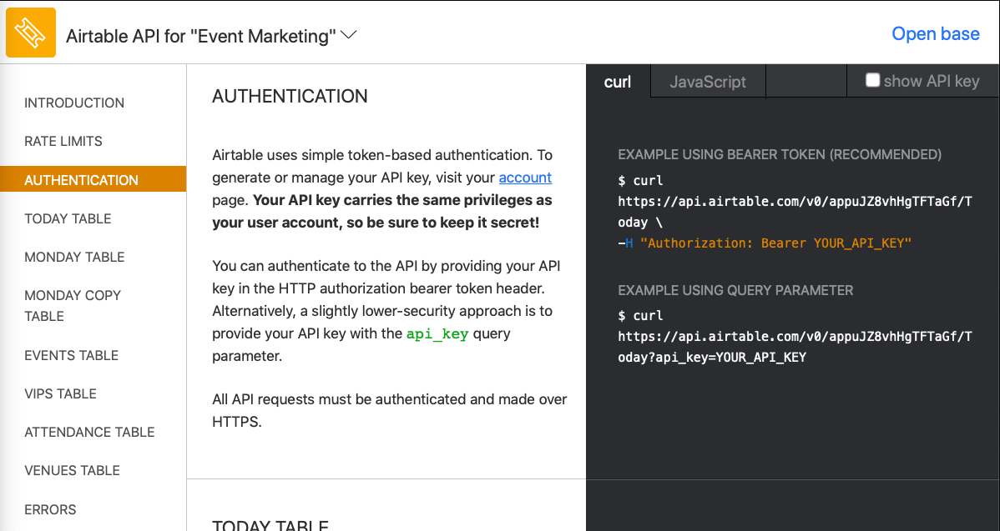
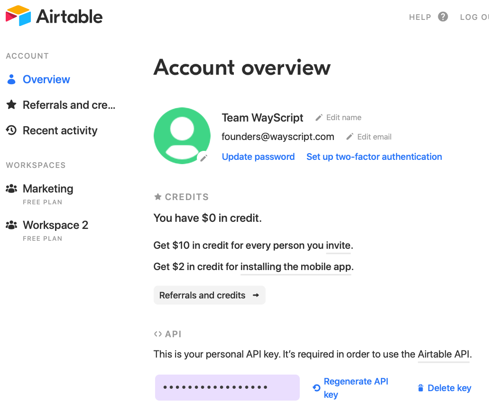
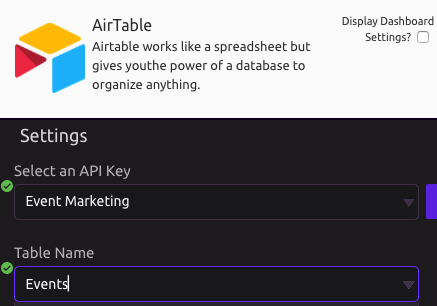
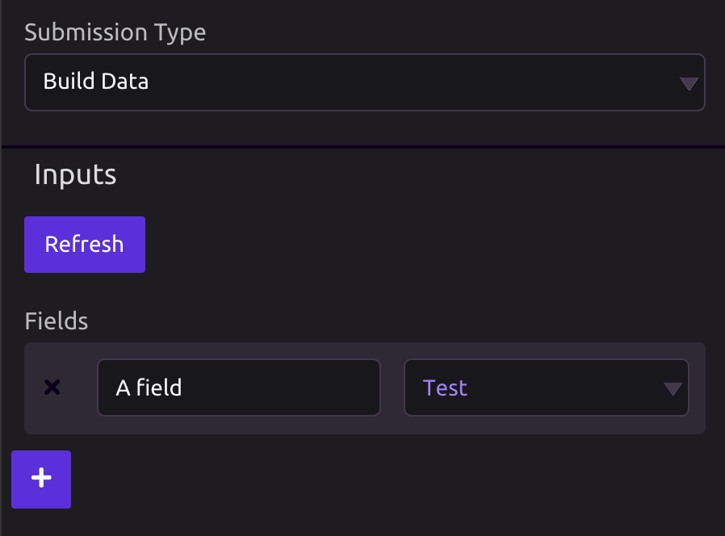
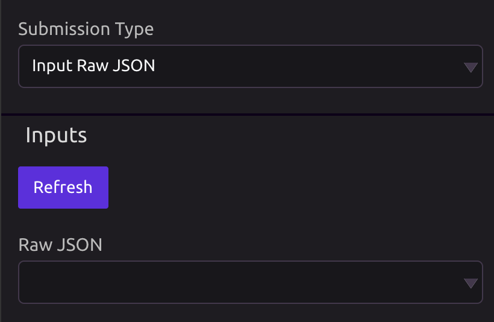

# Airtable

## Functionality

With the Airtable module you can:

* Read Table Data into WayScript
* Delete Table Rows
* Create New Table Rows

## Setting Up Your Airtable Account

### 1. Drag the Airtable module into your WayScript program

### 2. **In the Airtable Module, select "Add an Account" in the "Select an API Key" input**

### **3. A form will pop-up that allows you to connect your Airtable account**

Follow the instructions below for setting up each of these form inputs.

### 4. Navigate to the [**Airtable API page**](https://airtable.com/api)\*\*\*\*

### **5. Select the "base" you want to automate with WayScript**

In this example, we are using the "Event Marketing" base. Click on the base.

### **6. Add the name of the base to the "Workspace Name" field of the WayScript form**

### 7. **On the base API page, select "AUTHENTICATION" on the left navigation bar**

### **8. On the right side of the page, this highlighted key is your Base Key. Copy this key**

### **9. Paste the Base Key into the corresponding field of the WayScript form**

### 10. Go to your [Airtable account page](https://airtable.com/account)

### 11. **Double Click on and copy your API Key**

### **12. Paste the API Key into the corresponding field of the WayScript form**

### **13. Press the submit button on the form and you're ready to get started!**

## Working with a Table

Choose the table you want to work with in the "Table Name" input. \(In this case, the "Events" table.\)

### Select an Operation

Choose whether you would like to **Get Records**, **Delete Rows**, or **Create a New Record**.

### Get Records

The "Get Records" option allows you to retrieve data from a table.

You can choose whether you want to retrieve **All Rows**, rows that match a **Filter**, or a **Single Row**.

#### Filter Results

If you choose the "Filter" or "Single Row" option, you will need to define the filter you want to match on.

#### Matching Rows

All rows matching your settings above will display in the "Inputs" section.


Click the "Refresh" button for the most up-to-date results.


### Delete Rows

The "Delete Rows" option works much in the same way as the "Get Records" option, but deletes any matching records instead of retrieving them.

### Create a New Record

You also have the option to Create a New Record. 

If you choose this option, you can either:

* Build the data you would like to create using WayScript
* Input raw JSON

#### Build Data

If you opt to build Data yourself, you will need to define each of the fields you wish to input into the table.

#### Raw JSON

If you opt to input raw JSON, you will need to select the WayScript variable that contains that JSON.

## Outputs

Each column of your table will be available to select as an output from the Airtable module.

