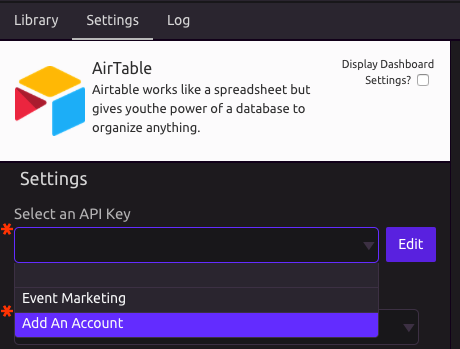
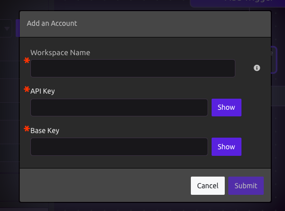
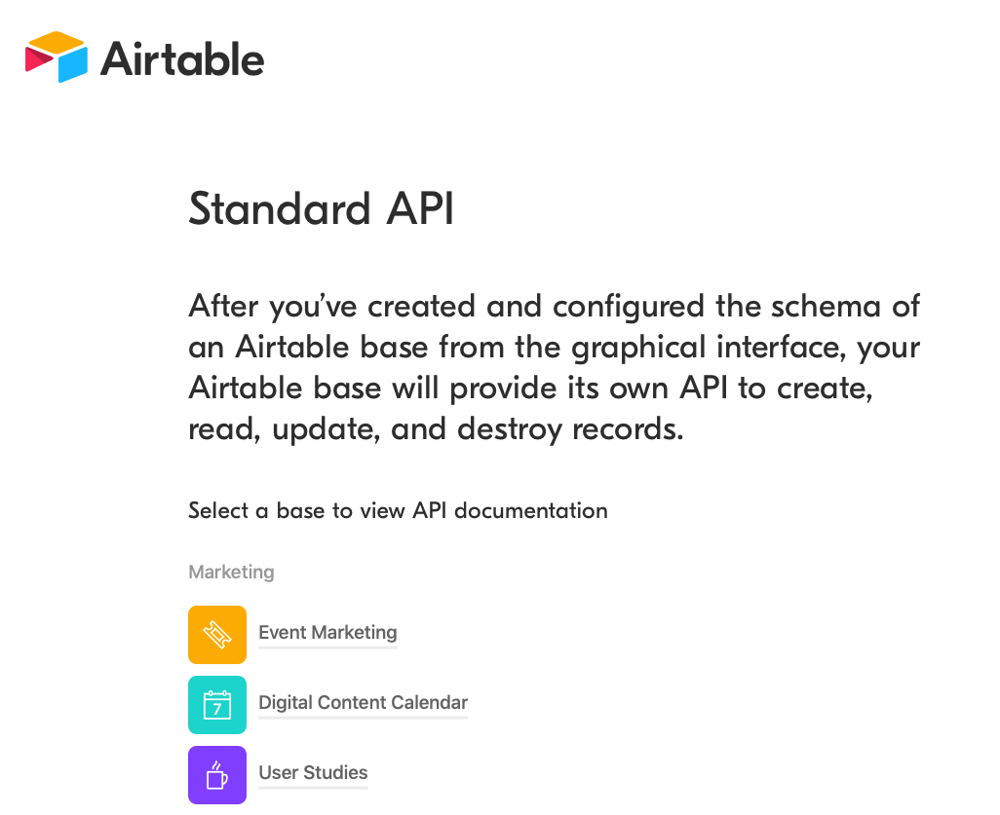
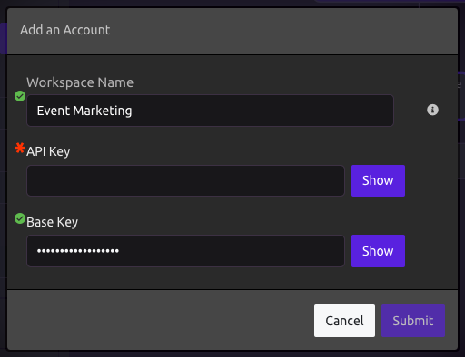
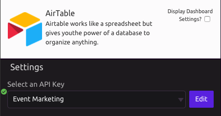
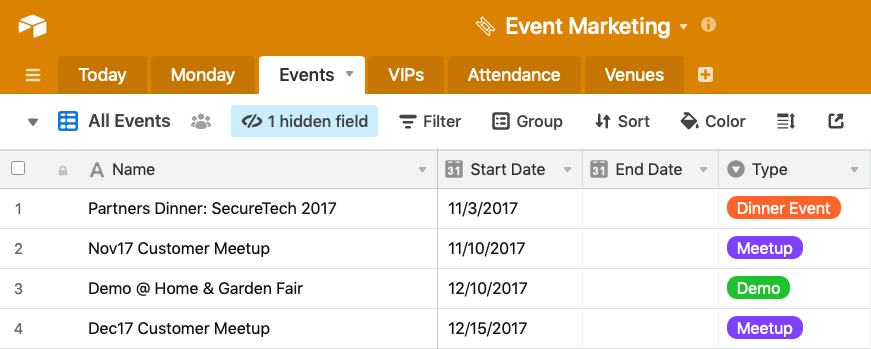
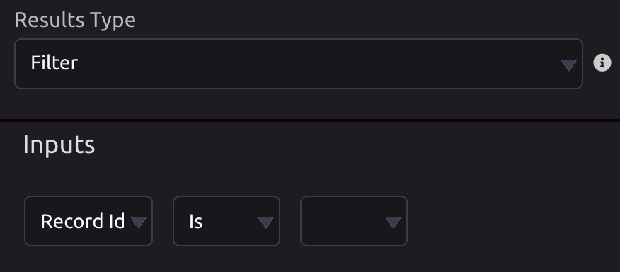
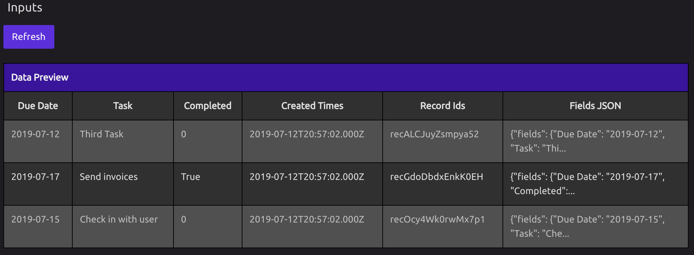
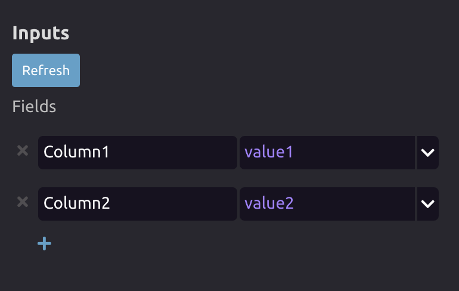
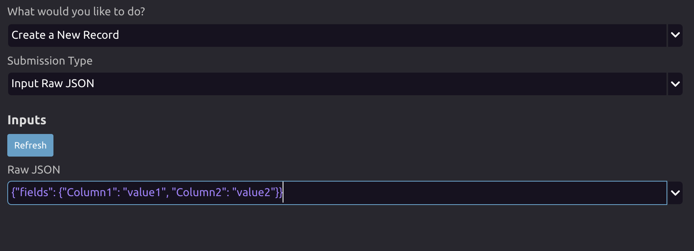

# Airtable


##  Functionality

With the Airtable module you can:

* Read Table Data into WayScript
* Delete Table Rows
* Create New Table Rows
* Update a Row

## ⚙ Setting Up Your Airtable Account

### 1. Drag the Airtable module into your WayScript program


### 2. **In the Airtable Module, select "Add an Account" in the "Select an API Key" input**



### **3. A form will pop-up that allows you to connect your Airtable account**

Follow the instructions below for setting up each of these form inputs.



### 4. Navigate to the [**Airtable API page**](https://airtable.com/api)\*\*\*\*



### **5. Select the "base" you want to automate with WayScript**

In this example, we are using the "Event Marketing" base. Click on the base.


### **6. Add the name of the base to the "Workspace Name" field of the WayScript form**


### 7. **On the base API page, select "AUTHENTICATION" on the left navigation bar**


### **8. On the right side of the page, this highlighted key is your Base Key. Copy this key**


### **9. Paste the Base Key into the corresponding field of the WayScript form**



### 10. Go to your [Airtable account page](https://airtable.com/account)


### 11. **Double Click on and copy your API Key**


### **12. Paste the API Key into the corresponding field of the WayScript form**


### **13. Press the submit button on the form and you're ready to get started!**



### 🎥 Video Tutorial



## 💼 Working with a Table

Choose the table you want to work with in the "Table Name" input. \(In this case, the "Events" table.\)




### 🔎 Select an Operation

Choose whether you would like to **Get Records**, **Delete Rows**, or **Create a New Record**.


### 🗃 Get Records

The "Get Records" option allows you to retrieve data from a table.

You can choose whether you want to retrieve **All Rows**, rows that match a **Filter**, or a **Single Row**.


#### Filter Results

If you choose the "Filter" or "Single Row" option, you will need to define the filter you want to match on.



#### Matching Rows

All rows matching your settings above will display in the "Inputs" section.




Click the "Refresh" button for the most up-to-date results.


### ❌ Delete Rows

The "Delete Rows" option works much in the same way as the "Get Records" option, but deletes any matching records instead of retrieving them.

### 🌟 Create a New Record

You also have the option to Create a New Record.

If you choose this option, you can either:

* Build the data you would like to create using WayScript
* Input raw JSON

#### Build Data

If you opt to build Data yourself, you will need to define each of the field values of the new row you wish to input into the table.




Raw JSON

If you opt to input raw JSON, you will need to select the WayScript variable that contains that JSON or Hardcoded JSON. Both of them need to be in the following forma \(The same format as a Fields JSON output item in Get Records\) :



### ✏ Update a Row

#### Update Type

* **PATCH** - A PATCH request will only update the fields you specify, leaving the rest as they were
* **PUT** - A PUT request will perform a destructive update and clear all unspecified cell values.

#### Submission Type

Build Data \(Recommended\)

* **Inputs:**
  * **Record ID** - The ID of the Record you want to update. This can be retrieved using the [Get Records](airtable.md#get-records) mode.
  * **Fields -** This is where you put the Key and Value that you want to update. The Key is the name of the column, the value is the new value you want for that cell. 

Input Raw JSON \(Advanced\)

* This mode allows you to input your own JSON or Struct into Airtable. The json MUST fit this structure:

```python
{ 
  'id' : '<INSERT_RECORD_ID>',
  'fields' : { 'column name' : 'new value', } 
}
```

#### Output

```graphql
Success: Bool //This tells you if the row successfully updated
```

## 📤 Outputs

Each column of your table will be available to select as an output from the Airtable module.

