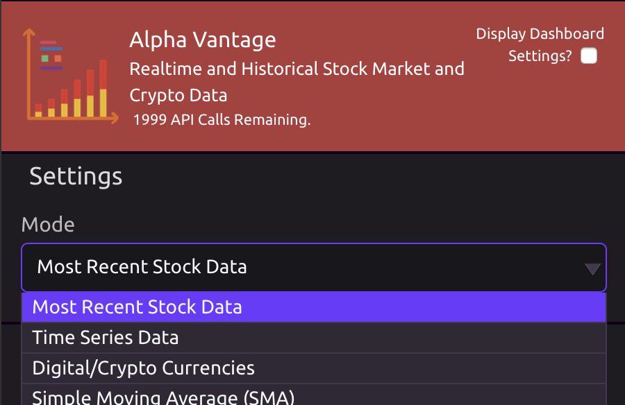
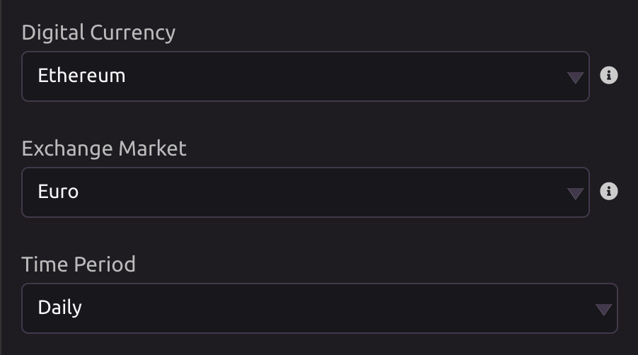
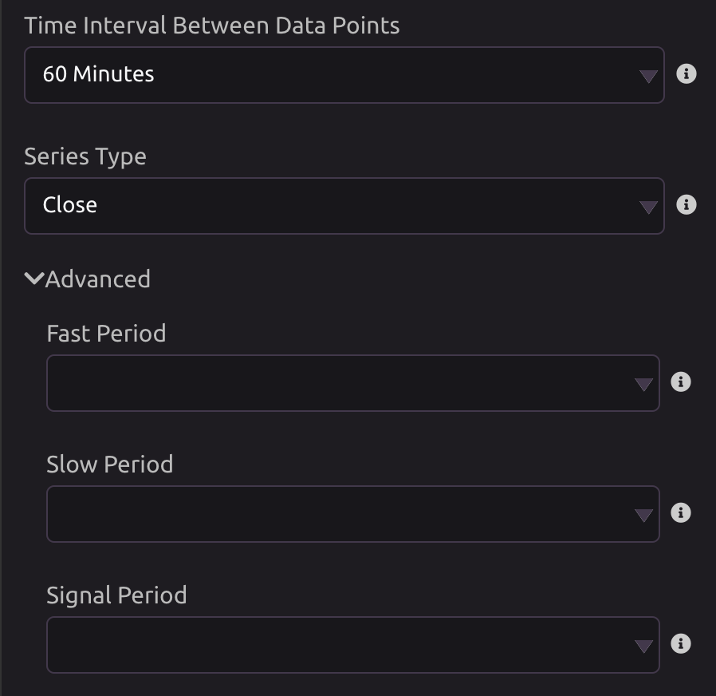
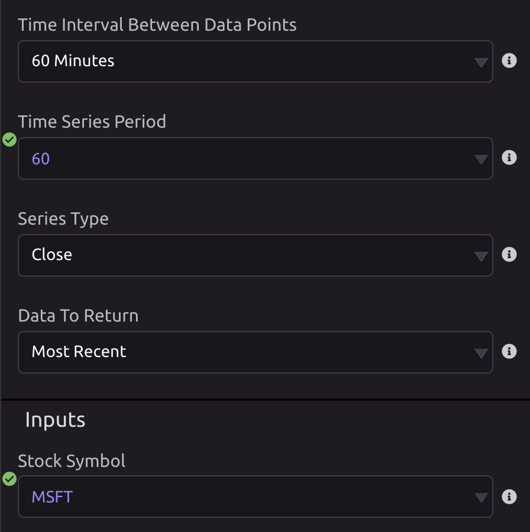
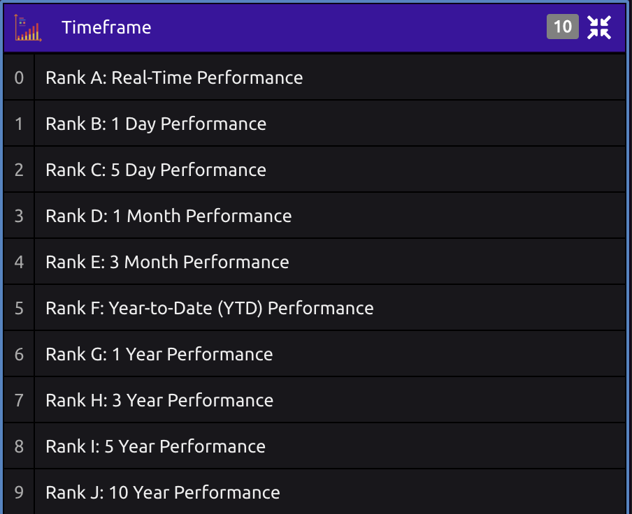
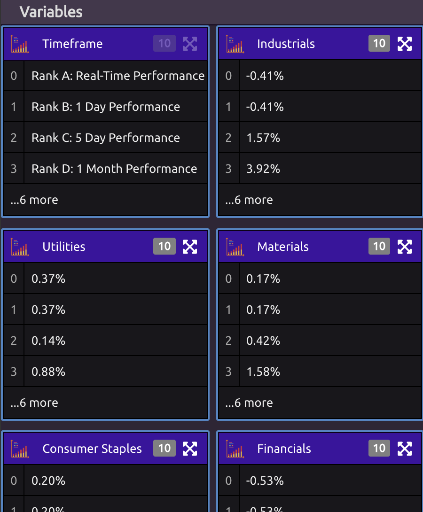

# Alpha Vantage

[Alpha Vantage Inc.](https://www.alphavantage.co/#about) "is a leading provider of free APIs for realtime and historical data on stocks, forex \(FX\), and digital/crypto currencies."

The WayScript Alpha Vantage module gives you easy access to this information.

## Most Recent Stock Data

### Inputs

Enter the name of the equity of your choice.

### Outputs

* Open
* High
* Low
* Close
* Volume
* JSON Data

## Time Series Data

### Settings

* Time Interval Between Data Points
* Time Period
* Output Size
  * Last 100 Data Points
  * All Data Points \(Returns the full-length time series of up to 20 years of historical data\)

### Inputs

Enter the name of the equity of your choice.

### Outputs

* Date
* Open
* High
* Low
* Close
* Volume
* JSON Data

## Digital/Crypto Currencies

### Settings

* Digital Currency
* Exchange Market
* Time Period

### Outputs

* Timestamp
* Open \(CNY\)
* High \(CNY\)
* Low \(CNY\)
* Close \(CNY\)
* Open \(USD\)
* High \(USD\)
* Low \(USD\)
* Close
* Volume
* Market Cap \(CNY\)
* JSON Data

## Simple Moving Average \(SMA\)

### **Settings**

* **Time Interval Between Data Points -** Time interval between two consecutive data points in the time series.
* **Time Series Period** - Number of data points used to calculate each SMA value. Positive integers are accepted. \(e.g. Time Period = 60, Time Period = 200\)
* **Series Type** - The desired price type in the time series. Four types are supported: Close, Open, High, Low.

### **Inputs**

Enter the name of the equity of your choice.

### **Outputs**

* Date
* SMA
* JSON Data

## Exponential Moving Average \(EMA\)

### **Settings**

* **Time Interval Between Data Points -** Time interval between two consecutive data points in the time series.
* **Time Series Period** - Number of data points used to calculate each EMA value. Positive integers are accepted. \(e.g. Time Period = 60, Time Period = 200\)
* **Series Type** - The desired price type in the time series. Four types are supported: Close, Open, High, Low.

### **Inputs**

Enter the name of the equity of your choice.

### **Outputs**

* Date
* EMA
* JSON Data

## Moving Average Convergence / Divergence \(MACD\)

For more information, see [How to use moving-average convergence divergence \(MACD\)](https://blog.liquid.com/cryptocurrency-technical-analysis-moving-average-convergence-divergence-macd).

### **Settings**

* **Time Interval Between Data Points -** Time interval between two consecutive data points in the time series.
* **Series Type** - The desired price type in the time series. Four types are supported: Close, Open, High, Low.

### Advanced Settings

* **Fast Period** - Defaults to 12.
* **Slow Period** - Defaults to 26.
* **Signal Period** - Defaults to 9.

### Outputs

* Date
* MACD
* MACD Signal
* MACD Histogram
* JSON Data

## Stochastic Oscillator \(STOCH\)

For more information, see [Stochastic oscillator](https://en.wikipedia.org/wiki/Stochastic_oscillator).

### **Settings**

* **Time Interval Between Data Points -** Time interval between two consecutive data points in the time series.

### Advanced Settings

* **Fast K Period** - Defaults to 5.
* **Slow K Period** - Defaults to 3.
* **Slow D Period** - Defaults to 3.
* **Slow K Moving Average Type**
  * Simple Moving Average \(SMA\)
  * Exponential Moving Average \(EMA\)
  * Weighted Moving Average \(WMA\)
  * Double Exponential Moving Average \(DEMA\)
  * Triple Exponential Moving Average \(TEMA\)
  * Triangular Moving Average \(TRIMA\)
  * T3 Moving Average
  * Kaufman Adaptive Moving Average \(KAMA\)
  * MESA Adaptive Moving Average \(MAMA\)
* **Slow D Moving Average Type**
  * Simple Moving Average \(SMA\)
  * Exponential Moving Average \(EMA\)
  * Weighted Moving Average \(WMA\)
  * Double Exponential Moving Average \(DEMA\)
  * Triple Exponential Moving Average \(TEMA\)
  * Triangular Moving Average \(TRIMA\)
  * T3 Moving Average
  * Kaufman Adaptive Moving Average \(KAMA\)
  * MESA Adaptive Moving Average \(MAMA\)

### Outputs

* Date
* Slow K
* Slow D
* JSON Data

## Relative Strength Index \(RSI\)

### **Settings**

* **Time Interval Between Data Points -** Time interval between two consecutive data points in the time series.
* **Time Series Period** - Number of data points used to calculate each RSI value. Positive integers are accepted. \(e.g. Time Period = 60, Time Period = 200\)
* **Series Type** - The desired price type in the time series. Four types are supported: Close, Open, High, Low.
* **Data to Return**
  * Most Recent \(Only the latest RSI\)
  * All

### **Inputs**

Enter the name of the equity of your choice.

### Outputs

* Date
* RSI
* JSON Data

## Average Directional Movement Index \(ADX\)

### **Settings**

* **Time Interval Between Data Points -** Time interval between two consecutive data points in the time series.
* **Time Series Period** - Number of data points used to calculate each ADX value. Positive integers are accepted. \(e.g. Time Period = 60, Time Period = 200\)

### **Inputs**

Enter the name of the equity of your choice.

### Outputs

* Date
* ADX
* JSON Data

## Commodity Channel Index \(CCI\)

### **Settings**

* **Time Interval Between Data Points -** Time interval between two consecutive data points in the time series.
* **Time Series Period** - Number of data points used to calculate each CCI value. Positive integers are accepted. \(e.g. Time Period = 60, Time Period = 200\)

### **Inputs**

Enter the name of the equity of your choice.

### Outputs

* Date
* CCI
* JSON Data

## Aroon \(AROON\)

For more information, see [Aroon](https://school.stockcharts.com/doku.php?id=technical_indicators:aroon).

### **Settings**

* **Time Interval Between Data Points -** Time interval between two consecutive data points in the time series.
* **Time Series Period** - Number of data points used to calculate each Aroon value. Positive integers are accepted. \(e.g. Time Period = 60, Time Period = 200\)

### **Inputs**

Enter the name of the equity of your choice.

### Outputs

* Date
* Aroon Down
* Aroon Up
* JSON Data

## Bollinger Bands \(BBANDS\)

For more information, see [Bollinger Bands](https://www.bollingerbands.com/bollinger-bands).

### **Settings**

* **Time Interval Between Data Points -** Time interval between two consecutive data points in the time series.
* **Time Series Period** - Number of data points used to calculate each band value. Positive integers are accepted. \(e.g. Time Period = 60, Time Period = 200\)
* **Series Type** - The desired price type in the time series. Four types are supported: Close, Open, High, Low.

### Advanced Settings

* **Number Deviation Up** - The standard deviation multiplier of the upper bound. Defaults to 2.
* **Number Deviation Down** - The standard deviation multiplier of the lower bound. Defaults to 2.
* **Moving Average Type**
  * Simple Moving Average \(SMA\)
  * Exponential Moving Average \(EMA\)
  * Weighted Moving Average \(WMA\)
  * Double Exponential Moving Average \(DEMA\)
  * Triple Exponential Moving Average \(TEMA\)
  * Triangular Moving Average \(TRIMA\)
  * T3 Moving Average
  * Kaufman Adaptive Moving Average \(KAMA\)
  * MESA Adaptive Moving Average \(MAMA\)

### **Inputs**

Enter the name of the equity of your choice.

### Outputs

* Date
* Real Middle Band
* Real Lower Band
* Real Upper Band
* JSON Data

## Chaikin A/D Line \(AD\)

### **Settings**

* **Time Interval Between Data Points -** Time interval between two consecutive data points in the time series.

### **Inputs**

Enter the name of the equity of your choice.

### Outputs

* Date
* Chaikin A/D
* JSON Data

## On Balance Volume \(OBV\)

### **Settings**

* **Time Interval Between Data Points -** Time interval between two consecutive data points in the time series.

### **Inputs**

Enter the name of the equity of your choice.

### Outputs

* Date
* OBV
* JSON Data

## Sector Performances \(SECTOR\)

Outputs performance data for various market sectors.

### Timeframe

The timeframe output gives the labels for each sector's data points.

### Sectors

* Utilities
* Consumer Staples
* Information Technology
* Real Estate
* Consumer Discretionary
* Industrials
* Materials
* Financials
* Communication Services
* Health Care
* Energy

### Other Outputs

* JSON Data

