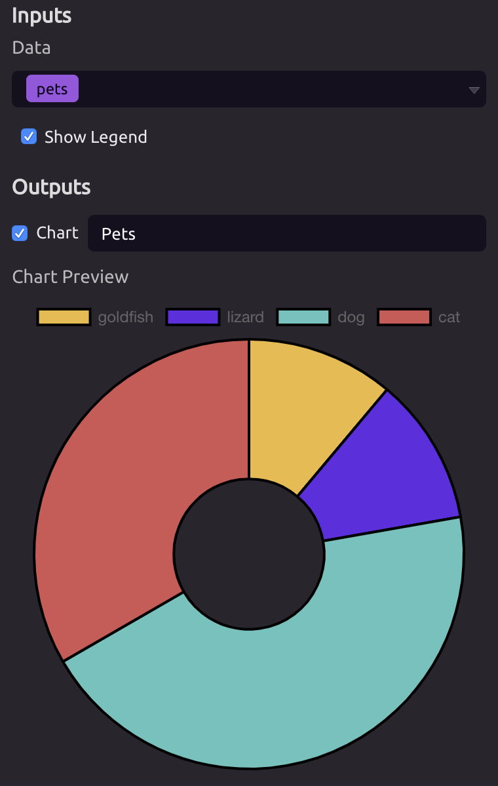

# Chart

## ⚙ Settings

**Chart Type -** Choose between a Line Chart or a Pie Chart.

## 📥 Inputs

### 🔢 Data

The data that will be used to build your chart. Different chart types take different kinds of data.

#### 📈 Line Chart

The Line Chart takes in two numeric data arrays, one for each axis of the chart. You can add multiple data series to your chart.

#### 🥧 Pie Chart

The Pie Chart takes in a single array of data. The frequency of each entry within the array will be used to generate the Pie Chart.

For example, suppose you have an array containing the type of pet each house in your neighborhood has:  `pets = [ 'dog', 'dog', 'dog', 'cat', 'cat', 'dog', 'lizard', 'goldfish', 'cat' ]`

You can use this list to build a Pie Chart of your data:

### 🗺 Show Legend

Toggle the chart's legend on or off.

## 📤 Outputs

**Chart -** The chart built from your data.

