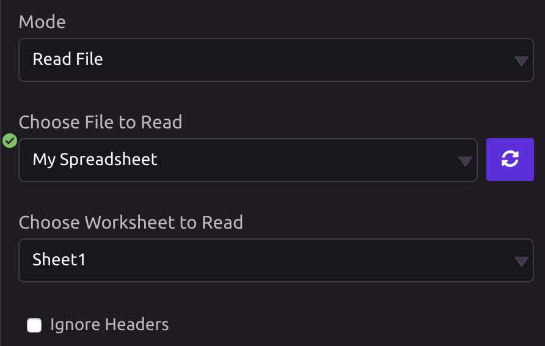
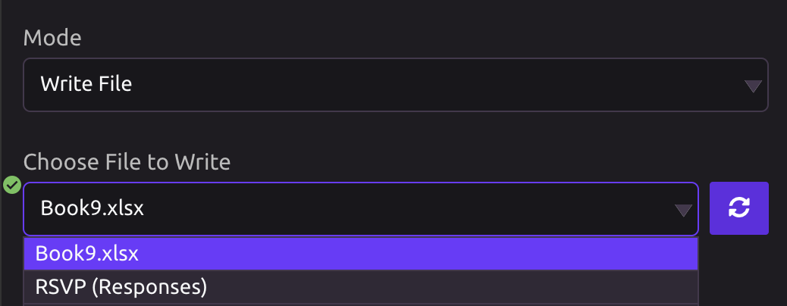
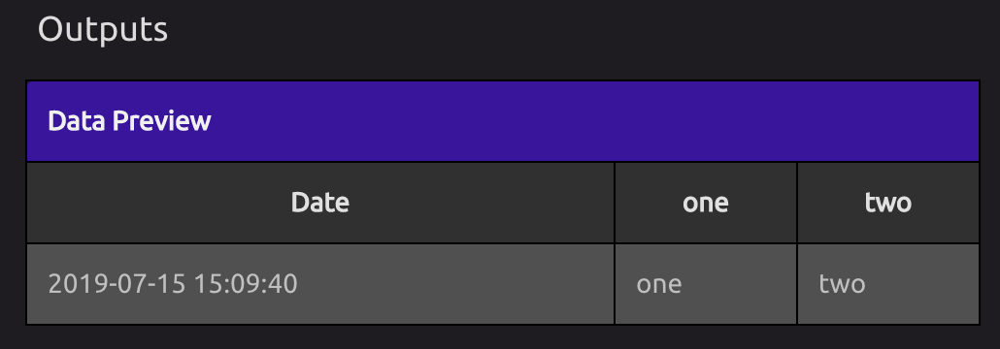

# Google Sheets


To run your script when a Google Sheet changes, use the [Google Sheets Trigger](../triggers/google-sheets-trigger.md).


## 🔗 Link Your Google Account

In order to use the Google Sheets module, you must first link your Google account.


You can add additional accounts from the Google Sheets module settings.


## 📖 Read File

When the Google Sheets module is activated, the default setting is to read a file.

Reading files allows you to import columns into WayScript as variables.

### 📂 Choose File to Read


If you do not see the Google Sheet you are looking for, click the refresh button.


### ➕ Importing Columns as Variables

Once a spreadsheet is selected, the spreadsheet will populate on the page.

* The **Choose Worksheet to Read** selector can be used to pull in data from different tabs on a spreadsheet.
* The **Ignore Headers** checkbox can be used to prevent WayScript from pulling in column headers if they exist in the file.


In order to import a column as a variable, the column must be labelled. Once labelled, the column will appear under variables.


## ✍ Write File

### 📂 Choose File to Write

Pick the Google Sheet you want your WayScript program to write to.


If you do not see the Google Sheet you are looking for, click the refresh button.


###  Choose a Worksheet

Select the Worksheet you would like to write.

### ☑ Include Headers

If "Include Headers" is selected, data headers will be written to your Google Sheet.

### ✏ Write Mode

* **Add To File:** Every time the program runs, new rows of data will be added to the bottom of the spreadsheet.
* **Replace File:** Every time the program runs, the file will be wiped clean before it is written.


If you are using the "Replace File" option in conjunction with "[Include Headers](google-sheets.md#include-headers)," you have the option to clear everything EXCEPT the header row using the "[Preserve Header Row](google-sheets.md#preserve-header-row)" setting.


### 🧹 Ignore Duplicates

The Google Sheets module allows you to ignore duplicates. If the same data already exists anywhere in the selected column\(s\) of the spreadsheet, the new row will not be written to the file.

#### Ignore All Columns

If the entire row is equal to another entire row in the spreadsheet, it will not write the row again. 

#### Ignore a Specific Column

If the selected column already contains the value about to be written to that row, the row will not be written.

### ➕ Add Your Variables

You need to assign values to columns by pressing the **+** button under "Add Your Variables."

The values of these variables will be written to your Google Sheets spreadsheet when your program runs.

You can add as many columns as you like.

### ⚡ Fire Notification

By default, changes WayScript makes to your Google Sheets do not fire notifications. This is to prevent your program from triggering another program with a [Google Sheets Trigger](../triggers/google-sheets-trigger.md).

If you want your changes to fire a notification, enable this setting in the "Advanced Settings" section.

### 📌 Preserve Header Row

If you are writing to a spreadsheet with both the "[Replace File](google-sheets.md#write-mode)" and "[Include Headers](google-sheets.md#include-headers)" options enabled and would like to replace everything EXCEPT the header row on each run of your script, enable this option under the "Advanced Settings" section. \(The header row is presumed to be the first row of your worksheet.\)

## 💡 Writing a List Variable to a Spreadsheet Column


To learn how to write each item of a list variable to a separate cell in a single column of your spreadsheet, see [Protip: Writing Lists to Spreadsheets](https://wayscript.com/blog_entry/38).


