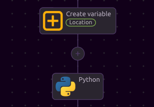
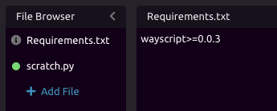

# Python



See [Code Editors](../../../getting_started/code-editors.md) for more information on composing code in WayScript.


## Working with Variables

###  📥 Inputs

WayScript's python editor lets you reference [Variables](../../../getting_started/variables.md) that exist in your program. To do this, you can reference them through the **variables dictionary**.

As an example, let's create a variable called "Location" and set a value of "Brooklyn, NY"



You can reference the Location variable in your python script with this code:

```python
location = variables[ "Location" ]
```

More abstractly, you reference any variable with the format:

```python
var = variables[ "<var_name>" ] 
```


You can drag your WayScript variables into your Python code to reference them that way, as well.


### 📤 Outputs

You can also output data from your python scripts and turn these into variables that can be used by other [Modules](../../../getting_started/modules.md) in your program. 

You can do this with the **variables dictionary** in the following format:

```python
variables[ "<Var Name>" ] = variable

# example
from datetime import datetime
variables[ "Date" ] = str( datetime.today() )
```


WayScript outputs can only be data structures such as strings, lists, dictionaries, etc., but cannot be class objects.


## ▶ Running Python

While working on your script, you can press the "Run Code" button inside the Python module to run the Python code and see updated results.

## 📦 Adding Additional Requirements

The Python module comes with [many pre-installed Python Libraries](libraries.md). However, if you would like to use a module that isn't already installed, you can declare those requirements in the "Requirements.txt" file.

Declare these requirements as you would in a [pip Requirements File](https://pip.pypa.io/en/stable/user_guide/#requirements-files), using the [Requirements File Format](https://pip.pypa.io/en/stable/reference/pip_install/#requirements-file-format).




For faster code execution, only add requirements that aren't already [pre-installed](libraries.md) in the Python module.


###  Referencing Python GitHub Repositories

To consume a Python GitHub repo as a package in your code, use the following format in your `requirements.txt` file:

```python
git+https://github.com/wayscript/wayscript-python.git#egg=wayscript
```

This example will install the `wayscript-python` package from GitHub, with the [egg](https://wiki.python.org/moin/egg) named "wayscript".


In order for this to work properly, you may also need to add all Python requirements from the project you are referencing to your `requirements.txt` file as well.


## ↘ Importing Code from Other Files

You can import code from the other Python files in your File Browser. For example, suppose you have a file called `foo.py`, which has a method `bar`.


You can import and use the `bar` method in `scratch.py` by using a relative import:

```python
from .foo import bar
```


## ✂ Code Snippets

See the page below for snippets of example code for achieving different tasks using the Python module:



## 🎓 Tutorial



