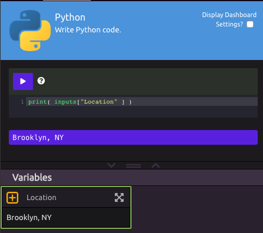
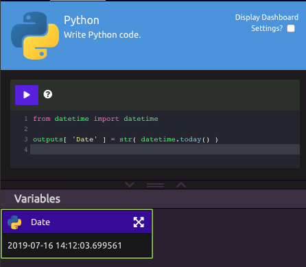

# Python

## Inputs

WayScript's Python editor lets you reference [Variables](../../../introduction/variables.md) that exist in your program. To do this, you can drag your variables into the codebox or reference them through the **inputs dictionary**.

As an example, lets create a variable called Location and set a value of "Brooklyn, NY"


You can reference the Location variable in your python script with this code:

```text
location = inputs[ "Location" ]
```

More abstractly, you reference any variable with the format:

```text
var = inputs[ "<var_name>" ] 
```



## Outputs

You can also output data from your python scripts and turn these into variables that can be used by other [Modules](../../../introduction/modules.md) in your program. 

You can do this with the **outputs dictionary** in the following format:

```text
outputs[ "<Var Name>" ] = variable

#example
from datetime import datetime
outputs[ "Date" ] = str( datetime.today() )
```



## Running Python

While working on your script, you can press the play button inside the python module to just run the python code. 

