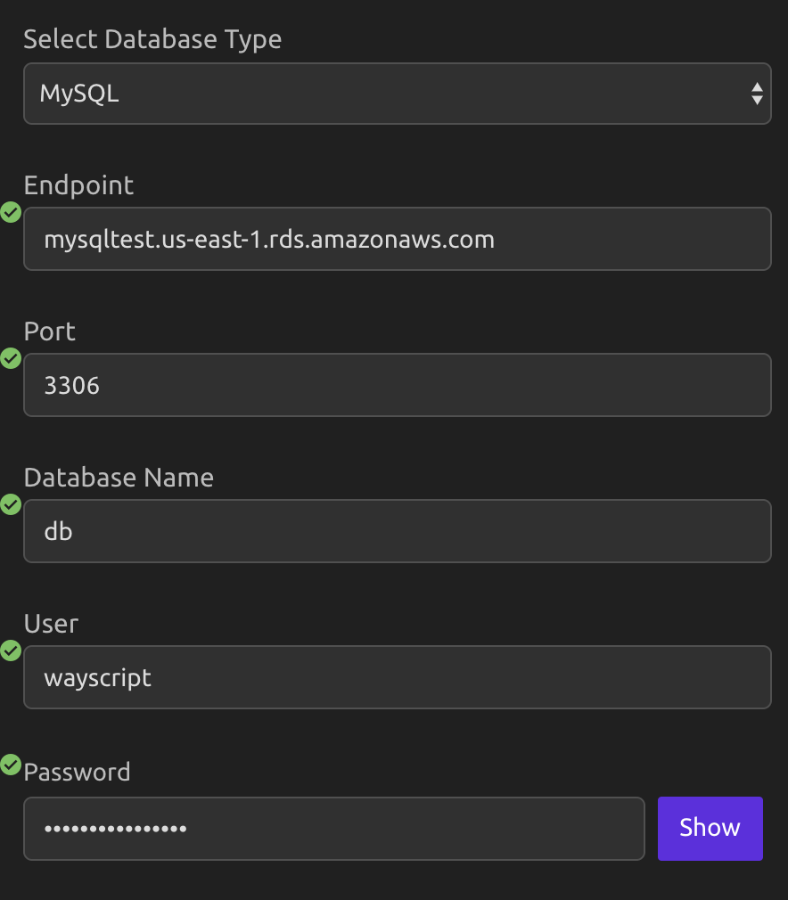
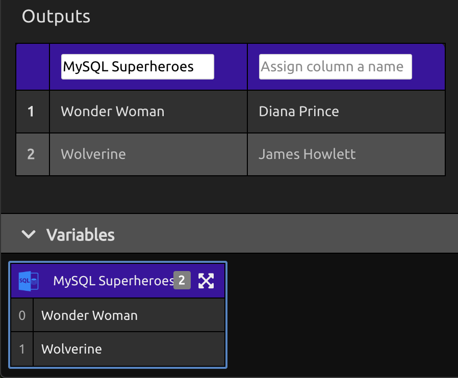

# SQL


See [Code Editors](../../getting_started/code-editors.md) for more information on composing code in WayScript.


## ⚙ Setup

### ➕ Add an Account

Select "Add an Account" to add a new database, or select a database you have already submitted.

The SQL module supports connections to **MySQL**, **SQL Server**, and **PostgreSQL** database instances.

### 🌟 Setting Up a New Database

You must supply the following information in order to connect to your database:

* **Database Type**: MySQL, SQL Server, or PostgreSQL.
* **Endpoint**: The publicly accessible URL for your database.
* **Port**: The port where your database instance accepts connections.
  * Defaults are **`3306`** for MySQL, **`1430`** for SQL Server, and **`5432`** for PostgreSQL.
* **Database Name**: The name of the database you want to run the query against.
* **User**: The username to use to connect to the database.
* **Password**: The corresponding password for the specified user.

## ✏ **Compose Your SQL Query**

Compose your SQL query in the "Query" input box.

You can run your query by clicking the **** \("play"\) button on the code box, or by running your program.

## 📤 **Outputs**

Any data returned by your SQL query will be displayed as a table in the "Outputs" section.

To use output data elsewhere in your program, assign a name to each column of data you want to use. The column will then appear as a list variable in your "Variables" panel.

## 🎓 **Tutorial**



