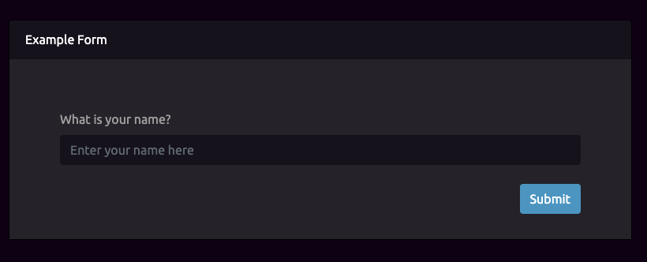

# Form Trigger


## ⚙ Setup

### Title and Description

You can add a title and description to your form to create context for your users. 

Once your trigger is activated, you can press the '**View Form**' button to be taken to the live, public endpoint for your form. This form can be shared with others you want to use your form. 

### Adding Form Inputs


In order to add an input, press **+ Add a Form Element.** You can add as many form elements as you want.


There are four input types you can currently choose from:

#### 1\) Text Input


**Title** - There are a few different parts of the element to notice. First, you can create a **title** for the input \(in the example image we are asking 'What is your name?'. 

**Required** - You can set required to On/Off - if on, a user is required to enter an answer before they can submit the form. 

**Placeholder** - This is just placeholder text you can enter for the text input. 




#### **2\) Text Area**

The Text Area element behaves identically to the [Text Input](form-trigger.md#1-text-input) element. The key difference is it provides space for a longer form answer. 

#### **3\) Selector**

The Selector element can be used to give users of the form a set of choices to choose from. In order to add options to your selector, press the **+ Add an Option** button. You can add as many options as you want. 


#### **4\) Radio Buttons**

The Radio element behaves exactly like the [Selector](form-trigger.md#3-selector) element above. The form will render the options as radio buttons. 


### Advanced

You can customize the CSS of your form for your own look and feel. 

## 👁🗨 View Form

In order to view your live form, make sure your trigger is active and then press the **View Form** button.


## 📤 Output

The Form Trigger will output a Struct of the responses to your form. 

```graphql
Form = {
    input_1 = 'Answer One',
    input_2 = 'Answer Two',
    ...
}
```

## 🎓 Tutorial



