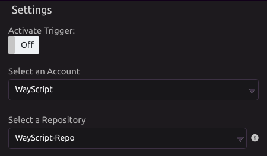

# GitHub Trigger


To automate actions with GitHub, use the [GitHub module](../modules/github.md).


## Link Your GitHub Account

When you drag in a GitHub Trigger for the first time, follow the prompt to authorize access.


You can add additional accounts from the GitHub Trigger settings.


## ⚙ Settings

###  Modes

* **Branch Events**
  * Run program when:
    * A branch is created.
    * A branch is deleted.
* **Issue Events**
  * Run program when:
    * An issue is opened.
    * An issue is closed.
    * An issue is commented on.
    * An issue is assigned.
    * An issue is unassigned.
    * An issue is labeled.
    * An issue is unlabeled.
* **Pull Request Events**
  * Run program when:
    * A pull request is opened.
    * A pull request is closed.
    * A pull request review is submitted.
    * A pull request review is modified.
    * A pull request is commented on.
    * A pull request's code is commented on.
* **Push Events**
  * Run program when there is a push to a repository branch.
  * Select a branch
    * If you choose **Any Branch**, the program will run on any push to that repository.

## 📤 Outputs

* **Branch Events**
  * Git Ref
    * The full git ref of the branch. Example: refs/heads/new-branch
  * Master Branch
  * Description
  * JSON Data
    * Raw JSON data received from the API.
* **Issue Events**
  * Title
  * URL
  * Username
  * Number
  * JSON Data
    * Raw JSON data received from the API.
* **Pull Request Events**
  * Title
  * URL
  * Username
  * Number
  * JSON Data
    * Raw JSON data received from the API.
* **Push Events**
  * Git Ref
    * The full git ref that was pushed. Example: refs/heads/master
  * Head
    * The SHA of the most recent commit on ref after the push.
  * Before
    * The SHA of the most recent commit on ref before the push.
  * Size
    * The number of commits in the push.
  * SHAs of Commits
    * List of the SHAs of each commit.
  * Messages of Commits
    * List of the messages of each commit.
  * Authors of Commits
    * List of the authors of each commit.
  * JSON Data
    * Raw JSON data received from the API.

