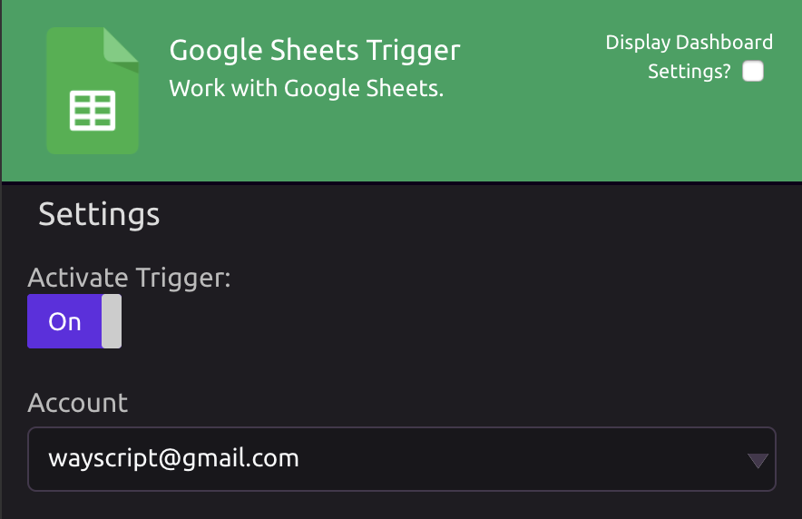
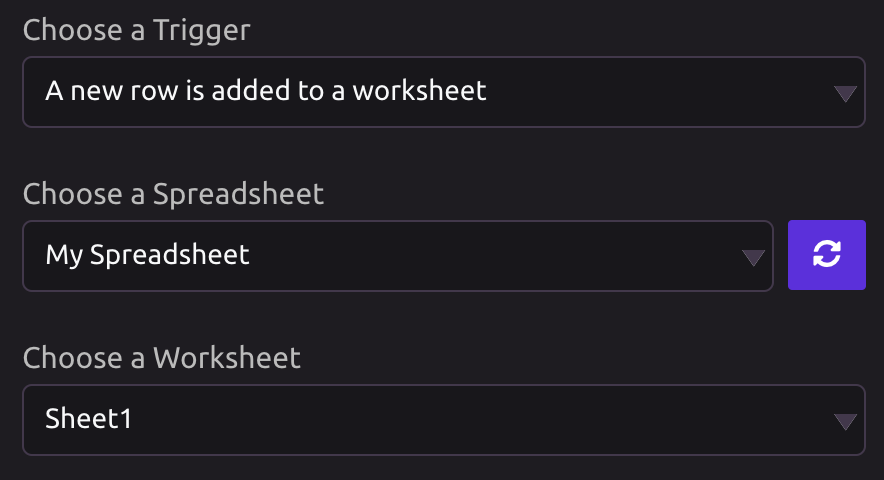
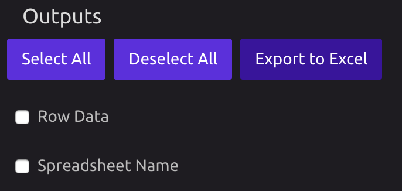
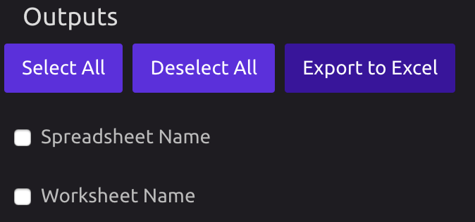

# Google Sheets Trigger


To read and write to Google Sheets, use the [Google Sheets module](../modules/google-sheets.md).


## 🔗Link Your Google Account

In order to use the Google Sheets Trigger, you must first link your Google account.


You can add additional accounts from the Google Sheets Trigger settings.


## ⚙Settings

### ⚡Choose a Trigger

Select what type of change to a Google Sheet will trigger your program:

* A new row is added to a worksheet
* A row is updated or a new row is added to a worksheet
* A new worksheet is added to a spreadsheet

### Choose a Spreadsheet/Worksheet

Depending on what type of Google Sheets change you selected in the step above, you will need to choose a Spreadsheet and Worksheet.


If you do not see the spreadsheet you are looking for, click the refresh button.


## 📤Outputs

If your selected change involves a row being added or updated, you will have the changed row's data available as an output.

Depending on the option you select, you may have the Spreadsheet or Worksheet Name available as an output.

