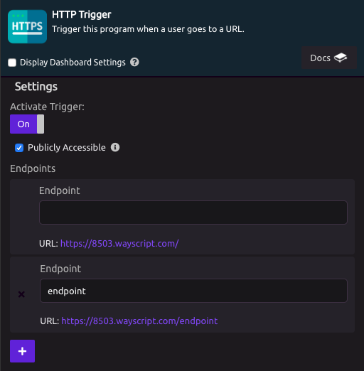
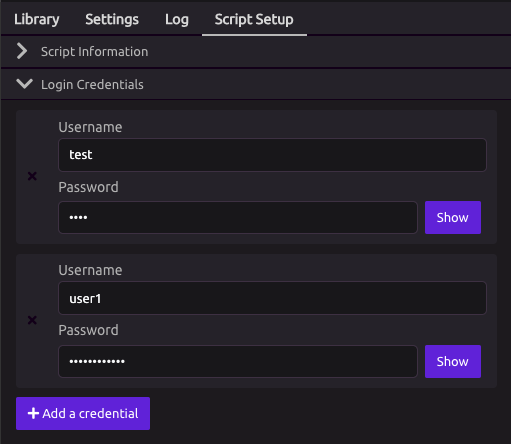
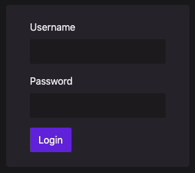

# HTTP Trigger


To display a webpage back to the user, use the [HTTP Response](../modules/http-response.md) module.


## ⚙ Setup

The HTTP Trigger is used to setup a web request. You can use it to implement a web page endpoint, a json post request, or other types of web requests.

### 🔗 Endpoints

To set up the HTTP Trigger, give your endpoint a name. You can also leave the field blank to match the root URL. You can add multiple endpoints.

To access the endpoint, use the program ID as a subdomain of wayscript.com. For example, in the image above, you could access this endpoint using https://8503.wayscript.com/endpoint.

Remember to Activate your trigger before using the endpoint.

### 🔐 Password-Protect your Endpoints

If you would like the endpoints in your HTTP trigger to require a login to view, uncheck the "Publicly Accessible" checkbox.

A button to "Manage Login Credentials" will appear.

Clicking this button will take you to the "Script Setup" tab, where you can manage the usernames and passwords that will allow people to log in to your endpoints.

When you click "Add a credential," a new login will be automatically generated for you, including a username and randomly-generated password. You can choose to use these values, or edit them as you see fit.

When a user goes to access your endpoint for the first time, they will now be prompted to login.

## 🎓 Tutorial



