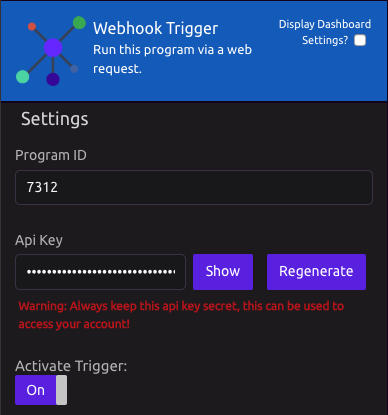
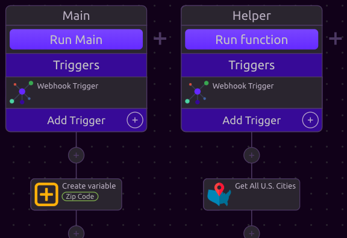

# Webhook Trigger


## ⚡Setup

Add the Webhook Trigger to the triggers section of your program and turn it on.

Webhooks require the following data:

1. Your Program ID
2. [Your unique API Key](../../account-management/managing-your-api-key.md)
3. Optional: [New variable inputs](webhook-trigger.md#new-variable-inputs)

This data can be retrieved from the settings within the Webhook Trigger.



## 📥New Variable Inputs

You can dynamically input new variable data into your WayScript programs from your api call. 

Declare the variables you want your Webhook Trigger to create and pass to your program in the Outputs section.


## 🏃♀Functions

You can specify which [function](../logic/functions/) you would like to run with your Webhook trigger.

Do this by placing the Webhook Trigger in one or more functions within your WayScript program, then specify which function you would like to run by passing the function name via the "function" parameter in your api call.



## 📨API Call

Use [Python](https://github.com/wayscript/wayscript-python), [JavaScript](https://github.com/wayscript/wayscript-js), or [any other programming language ](../../apis/rest.md)to trigger your program.

```python
import requests

url = 'https://wayscript.com/api?'

variables = [ 'new_name', 'www.new_url.com' ]

params = {
    'api_key'   : 'YOUR_API_KEY',  # insert api key
    'program_id': 3726,            # insert program id
    'variables' : variables,       # (optional)
    'function'  : 'My Function'    # insert function name (optional)
}

requests.post( url, params = params )
```


Variables must be submitted in the same order as the Outputs defined on the Trigger Module as displayed above. 



For information on finding your API Key, see [Managing Your API Key](../../account-management/managing-your-api-key.md).



Never share your API Key with anyone else; it is equivalent to giving them your password.


